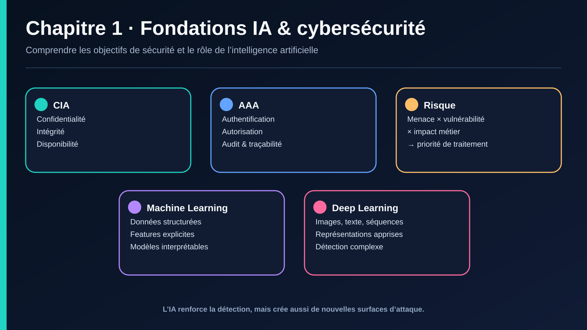

# I. INTRODUCTION GÉNÉRALE

## I.1 Introduction à la cybersécurité

### a. Définition & enjeux

> **Définition — Cybersécurité**
> La cybersécurité est l'ensemble des méthodes, processus, outils et comportements visant à protéger les systèmes informatiques, les réseaux et les données contre les cyberattaques et les accès non autorisés.

Même si elle repose en grande partie sur la technologie, l'efficacité de la cybersécurité dépend également fortement des individus.

**Les enjeux** :
- **Complexité croissante** — Plus il y a d'outils et de technologies, plus la sécurité devient difficile à gérer.
- **Menaces en évolution** — Les attaques sont de plus en plus sophistiquées et difficiles à détecter.
- **Stratégies obsolètes** — Les anciennes méthodes de sécurité ne suffisent plus face aux menaces modernes.

### b. Concepts clés

**1 — CIA Triad (Confidentiality – Integrity – Availability)**
- Confidentialité : protection contre l'accès non autorisé.
- Intégrité : assurance que les données n'ont pas été altérées.
- Disponibilité : accès garanti aux ressources pour les utilisateurs autorisés.

**2 — Authentification, Autorisation, et Audit (AAA)**
- Authentification : vérifier qui est l'utilisateur (ex : login + mot de passe).
- Autorisation : ce que l'utilisateur a le droit de faire.
- Audit : journalisation des actions pour contrôle et traçabilité.

**3 — Menaces, vulnérabilités, et risques**
- Menace (Threat) : un danger potentiel (ex. : hacker, malware).
- Vulnérabilité : une faille exploitable (ex. : port ouvert, mot de passe faible).
- Risque : impact potentiel (menace × vulnérabilité).

> ⚠️ **Formule simple** : Risque = Menace × Vulnérabilité × Impact

**4 — Mesures de sécurité (Controls)**
- Préventives : éviter l'incident (firewall, antivirus, formation).
- Détectives : identifier l'incident (SIEM, IDS).
- Correctives : corriger après incident (restauration, patchs).

**5 — Principes de sécurité**
- Least privilege (moindre privilège)
- Defense in depth (défense en profondeur)
- Fail secure (mieux vaut bloquer qu'ouvrir en cas de problème)
- Security by design (penser sécurité dès la conception)

**6 — Types de sécurité**
- Sécurité physique : accès aux serveurs, caméras, badges.
- Sécurité logique : mots de passe, pare-feux, antivirus.
- Sécurité organisationnelle : politiques internes, procédures.

**Ce qu'un framework de cybersécurité doit couvrir** : Identify → Protect → Detect → Respond → Recover (cycle NIST CSF), appuyé sur des briques techniques : Network Access Control (NAC), Attack Surface Management, Firewall, Antivirus & Sandboxing, Web/DNS Filtering, Intrusion Prevention Systems (IPS), Remote Access VPNs.

### c. Types d'attaques

#### Par ingénierie sociale

**Attaques de phishing**
Le phishing (hameçonnage) est une attaque où un pirate envoie des e-mails frauduleux imitant une source de confiance afin de voler des informations sensibles (mots de passe, données bancaires…). L'attaquant utilise un lien piégé pour diriger la victime vers un site malveillant. Souvent, la victime ne se rend pas compte de l'attaque, ce qui permet à l'attaquant de se propager dans l'organisation.

*Pour se protéger* : être vigilant avant de cliquer sur un lien ou ouvrir une pièce jointe ; vérifier les en-têtes d'e-mails, les champs « Reply-to » et « Return-path ».

| Variante | Cible | Objectif | Tactique | Prévention |
|---|---|---|---|---|
| **Whale Phishing** | Dirigeants, cadres supérieurs (CEO, CFO) | Infos sensibles ou pression via ransomware | E-mails très convaincants | Vérification des expéditeurs, vigilance accrue |
| **Spear Phishing** | Une personne spécifique, ciblée après recherche | Vol de données perso/pro | E-mails personnalisés, spoofing, clonage de sites | Vérifier adresses e-mail, URLs, liens vérifiés |
| **Smishing** *(complément)* | Utilisateur mobile | Vol d'identifiants via SMS frauduleux | SMS imitant banque/livraison | Ne jamais cliquer un lien SMS non vérifié |
| **Vishing** *(complément)* | Utilisateur par téléphone | Extorsion vocale, souvent via deepfake voix (cf. IV) | Appel usurpant une voix connue | Procédure de vérification hors-bande |

> L'humain est le maillon faible.

#### Sur la confidentialité

**Vol de données / Data Breach** — Accès non autorisé à une base de données ou des fichiers sensibles. Souvent dû à un mot de passe faible, une mauvaise configuration serveur, une vulnérabilité logicielle.
*Protection* : MFA, chiffrement au repos/en transit, moindre privilège, mises à jour, SIEM.

**Sniffing / Eavesdropping** — Écoute passive des communications réseau. Sur un Wi-Fi non sécurisé, un pirate peut capturer les mots de passe échangés en clair.
*Protection* : HTTPS/TLS systématique, éviter le Wi-Fi public non sécurisé ou utiliser un VPN, segmentation réseau, IDS/IPS.

**Keylogging** — Logiciel ou matériel enregistrant les frappes clavier. Installé via malware, phishing ou clé USB malveillante.
*Protection* : antivirus/EDR à jour, ne pas télécharger de logiciels douteux, limiter les privilèges, claviers virtuels/2FA.

#### Sur la disponibilité

**Attaques DoS et DDoS** — Le déni de service vise à saturer les ressources d'un système. Le DDoS est lancé depuis un grand nombre de machines infectées (botnet) contrôlées par l'attaquant. L'objectif : rendre un service indisponible, pas d'y accéder.
*Protection* : pare-feu filtrant le trafic légitime du malveillant. Exemple notable : l'attaque contre AWS en février 2020.

**Botnets** — Réseau d'ordinateurs infectés (« zombies ») contrôlés à distance. Usages : DDoS, spam massif, vol d'identifiants, minage de crypto-monnaie.

#### Sur l'intégrité

**SQL Injection** — Injection de code SQL malveillant dans des champs de saisie pour manipuler une base de données. Peut mener à fuite, modification, suppression de données, voire exécution de commandes système.
*Protection* : moindre privilège, validation/sécurisation de toutes les entrées utilisateur (requêtes préparées, ORM).

**Attaques MITM (Man-in-the-Middle)** — Interception des communications entre deux parties à leur insu. Le détournement de session (session hijacking) est une variante de MITM où l'attaquant prend le contrôle d'une session client-serveur.
*Protection* : chiffrement fort sur les points d'accès, VPN.

#### Logiciels malveillants (Malwares)

| Type | Mécanisme | Exemple |
|---|---|---|
| **Virus** | S'attache à un fichier légitime ; se propage à l'ouverture | Clé USB infectée corrompant des fichiers |
| **Ver (worm)** | Se propage automatiquement via le réseau, sans action utilisateur | WannaCry (2017), exploitant une faille Windows |
| **Cheval de Troie (Trojan)** | Se fait passer pour un logiciel utile, installe un accès malveillant en secret | Faux logiciel de facturation ouvrant une porte dérobée |
| **Ransomware** | Bloque l'accès au système/fichiers jusqu'au paiement d'une rançon | Propagation via pièces jointes, réseau interne, clés USB ; peut contourner les antivirus classiques |
| **Spyware** *(complément)* | Collecte discrètement des informations sur l'utilisateur | Suivi de navigation, capture d'écran |
| **Rootkit** *(complément)* | Dissimule la présence d'un malware en modifiant le système d'exploitation | Persistance profonde, difficile à détecter |

*Protection générale* : antivirus/EDR à jour, ne pas ouvrir de pièces jointes suspectes, mises à jour système régulières, droits administrateurs limités.

#### Attaques avancées

**APT (Advanced Persistent Threats)** — Attaques longues, discrètes, souvent menées par des groupes organisés (cyber-espionnage). L'attaquant s'infiltre, reste caché, exfiltre des données sur des mois.
*Protection* : surveillance continue (logs, SIEM), segmentation réseau, threat intelligence, sécurité des accès privilégiés.

**Attaques Zero-Day** — Exploitent une faille encore inconnue du fabricant. Très dangereuses car aucun correctif n'existe encore.
*Protection* : patchs de sécurité rapides, détection comportementale (SIEM, EDR), réduction de la surface d'attaque.

#### Tableau récapitulatif — Attaques vs CIA Triad

| Attaques | Confidentialité | Intégrité | Disponibilité |
|---|---|---|---|
| Data breach | ✓ | ✗ | ✗ |
| Sniffing | ✓ | ✗ | ✗ |
| MITM | ✓ | ✓ | ✗ |
| Virus / Trojan | ✓ | ✓ | ✗ |
| Ransomware | ✓ | ✓ | ✓ |
| Spyware / Keylogger | ✓ | ✗ | ✗ |
| Phishing / Spear Phishing | ✓ | ✗ | ✗ |
| DoS / DDoS | ✗ | ✗ | ✓ |
| Injection SQL | ✗ | ✓ | ✗ |
| Zero-Day | ✓ | ✓ | ✓ |
| APT | ✓ | ✓ | ✓ |

## I.2 L'IA & Deep Learning

### a. Définitions

```
Intelligence artificielle
   └── Machine Learning
          └── Deep Learning
```

**Intelligence artificielle** — Domaine général visant à créer des systèmes qui imitent des comportements humains intelligents. Inclut les systèmes à règles (logique, arbres de décision faits main), les agents intelligents (chatbots, systèmes experts), le ML et le DL. Pas forcément « apprenant » : un algorithme à base de règles peut être considéré comme une IA.

**Machine Learning** — Sous-domaine de l'IA : les machines apprennent automatiquement à partir de données sans être explicitement programmées. L'algorithme trouve des motifs dans les données, puis génère un modèle capable de faire des prédictions.
Algorithmes classiques : K-Nearest Neighbors (KNN), Decision Trees, Random Forest, Support Vector Machines (SVM), Naive Bayes, Régressions (linéaire, logistique).
*Avantages* : peu de données suffisent souvent, interprétables (selon l'algo). *Désavantages* : moins performants sur des tâches complexes (vision, NLP).

**Deep Learning** — Sous-domaine du ML : modèles basés sur des réseaux de neurones profonds, capables de traiter des données complexes (images, texte, etc.). Utilise des réseaux de neurones artificiels (ANN) ; les réseaux profonds (> 2 couches) apprennent des fonctions très complexes.
Exemples : CNN (images), RNN/LSTM/Transformers (séquences, texte), Autoencoders, GANs.
*Avantages* : très performant sur les grandes bases de données (vision, texte, voix). *Désavantages* : demande beaucoup de calcul et de données, moins interprétable.

### b. Machine Learning vs Deep Learning

| Critère | Machine Learning | Deep Learning |
|---|---|---|
| Type de données | Tableaux (features tabulaires) | Images, audio, texte, séquences |
| Quantité de données | Moins | Beaucoup (1000s à millions d'exemples) |
| Prétraitement | Nécessaire (feature engineering) | Moins nécessaire (le réseau apprend seul) |
| Temps d'entraînement | Rapide | Long (surtout sans GPU) |
| Interprétabilité | Plus facile | Moins interprétable (« boîte noire ») |

**Utiliser ML si** : données structurées/tabulaires, dataset pas très grand (1k-100k lignes), besoin d'interprétabilité, entraînement rapide requis.
*Exemples* : prédire un prix immobilier, détection de fraude bancaire, analyse de churn, prédiction de panne via capteurs.

**Utiliser DL si** : données non structurées (images, sons, textes, séries longues), beaucoup de données (> 100k exemples), haute performance recherchée quitte à perdre en interprétabilité.
*Exemples* : reconnaissance vocale, détection d'objets, traduction automatique, **analyse de logs/alertes pour détection d'attaques (IDS) en cybersécurité**.

> **Quand l'interprétabilité est cruciale** : en médecine (justifier un classement à risque), en banque (justifier un refus de prêt), et **en cybersécurité (justifier une alerte comme étant une attaque vs un faux positif)**. Dans ces domaines, on privilégie parfois des modèles moins performants mais interprétables (arbres de décision).

### c. Structure d'un modèle de Deep Learning

```
Input layer → Hidden layers → Output layer
```

**Couche d'entrée (input layer)** — Ne fait pas de calcul « intelligent » ; reçoit les données brutes et les encode numériquement. Ex. : image 28×28 → vecteur de 784 valeurs ; texte → embeddings ; audio → spectrogramme.

**Couches cachées (hidden layers)** — Là où se fait l'apprentissage. Chaque neurone calcule `z = Σ(wᵢ·xᵢ) + b` puis applique une fonction d'activation `a = f(z)`. La **profondeur** = nombre de couches cachées.

Types de couches cachées :
- **Dense (fully connected)** — chaque neurone connecté à tous ceux de la couche précédente ; généraliste (MLP, classification).
- **Convolutionnelle (CNN)** — applique des filtres (kernels 3×3, 5×5…) qui balayent l'entrée pour détecter des motifs (contours, textures) ; poids partagés → moins de paramètres. Utilisée pour vision, audio, NLP (Conv1D).
- **Récurrente (RNN, LSTM, GRU)** — traite des séquences : `hₜ = f(Wxₜ + Uhₜ₋₁ + b)`. LSTM/GRU ajoutent des portes (gates) pour contrôler ce qu'on garde ou oublie. Utilisée pour texte, audio, séries temporelles.
- **Dropout** — éteint aléatoirement un pourcentage de neurones (p=0.2 à 0.5) pendant l'entraînement pour éviter le surapprentissage (régularisation).
- **Batch Normalization** — normalise les activations d'une couche (moyenne ≈ 0, variance ≈ 1) pour stabiliser et accélérer l'entraînement.

**Fonctions d'activation pour les couches cachées** :

| Fonction | Formule | Plage | Utilisation |
|---|---|---|---|
| ReLU | f(x) = max(x, 0) | [0, +∞[ | Standard (CNN, MLP, Transformers) ; risque de « neurones morts » |
| Leaky ReLU / PReLU | x si x≥0, αx sinon | ℝ | Évite les neurones morts |
| ELU | x si x≥0, α(eˣ-1) sinon | ℝ | Version lisse de ReLU |
| Tanh | (eˣ-e⁻ˣ)/(eˣ+e⁻ˣ) | [-1, 1] | RNN classiques |
| Sigmoid | 1/(1+e⁻ˣ) | [0, 1] | Historique, saturante |
| Swish / Mish | x·sigmoid(x) / variante lissée | ℝ | Architectures modernes (EfficientNet, Transformers) |

**Couche de sortie (output layer)** — Transforme les représentations apprises en résultat final adapté à la tâche.

| Tâche | Activation | Fonction de coût | Exemple |
|---|---|---|---|
| Régression | Identity (linéaire) | MSE / MAE | Prédire un prix, une température |
| Classification binaire | Sigmoid | Binary Cross-Entropy | Malade/pas malade, spam/pas spam |
| Classification multi-classes | Softmax | Cross-Entropy | Chat/chien/oiseau |
| Multi-label | Sigmoid par neurone | Binary Cross-Entropy par label | Image contenant chien + chat |
| Segmentation d'images | Softmax ou Sigmoid par pixel | Cross-Entropy | Imagerie médicale, segmentation routière |

### d. Cycle d'apprentissage d'un réseau de neurones

1. **Forward propagation** — chaque couche calcule `z⁽ˡ⁾ = W⁽ˡ⁾a⁽ˡ⁻¹⁾ + b⁽ˡ⁾`, puis `a⁽ˡ⁾ = f⁽ˡ⁾(z⁽ˡ⁾)`, jusqu'à obtenir la prédiction `ŷ = a⁽ᴸ⁾`.
2. **Calcul de la perte (loss)** — compare `ŷ` à `y` : MSE en régression, Binary Cross-Entropy en classification binaire, Cross-Entropy + Softmax en multi-classes.
3. **Backpropagation** — propage l'erreur de la sortie vers les couches cachées via la règle de dérivation en chaîne, pour calculer le gradient de la perte par rapport à chaque poids et biais.
4. **Descente de gradient** — met à jour les paramètres : `W⁽ˡ⁾ ← W⁽ˡ⁾ - η·∂ℒ/∂W⁽ˡ⁾`, où η est le taux d'apprentissage (learning rate).

**Boucle d'entraînement** : répéter 1→4 pour chaque mini-batch ; un passage complet sur le dataset = 1 époque ; répéter plusieurs époques jusqu'à convergence.

### e. Lien entre IA et cybersécurité

**Lien positif** — l'IA sert la défense : analyse d'anomalies, détection de menaces, réponse automatique.
**Lien négatif** — la cybersécurité doit protéger l'IA elle-même : ses données d'apprentissage, ses modèles, ses décisions.

| Catégorie | Exemples |
|---|---|
| Attaques **détectées** par l'IA | Phishing, ransomwares, DDoS |
| Attaques **générées** par l'IA | E-mails malveillants créés par IA, deepfakes |
| Attaques **contre** l'IA | Data poisoning, attaques adversariales |

*(Ces trois axes sont développés en détail aux chapitres III et IV.)*

---



---

## Navigation

← Début du cours · [Sommaire](../README.md) · [Chapitre 2 →](./02-ml-pour-la-cybersecurite.md)

> Source pédagogique : support « IA pour la cybersécurité » — Dr. HONNIT Bouchra. Mise en forme Markdown et illustration de synthèse ajoutées pour ce dépôt.
