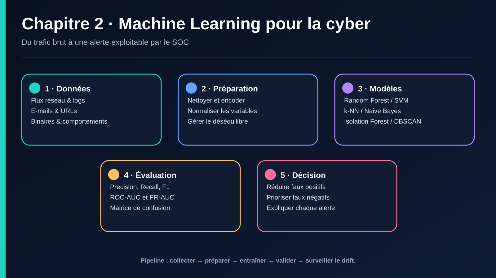

# II. ML POUR LA CYBERSÉCURITÉ

## Objectif
Utiliser des modèles classiques (SVM, Random Forest, k-NN) pour détecter des menaces, et mettre en œuvre des pipelines de traitement complets (préparation des données, vectorisation, normalisation, évaluation des performances).

## II.1 Attaques & données

Pour entraîner un modèle ML de cybersécurité, il faut d'abord identifier la **source de données** correspondant au type de menace visé.

| Type de détection | Source de données | Exemples de jeux publics |
|---|---|---|
| Détection d'intrusion réseau (IDS) | Flux réseau, paquets, NetFlow | NSL-KDD, CICIDS2017/2018, UNSW-NB15 |
| Détection de malware | Binaires exécutables, hashs, comportements sandbox | EMBER, VirusShare (metadata), Malware Bazaar |
| Détection de phishing | URLs, contenu HTML/e-mail, métadonnées DNS | PhishTank, UCI Phishing Websites |
| Détection de fraude | Transactions, logs applicatifs | Kaggle Credit Card Fraud |
| Analyse de logs / SIEM | Logs système, logs applicatifs, logs d'authentification | LANL Auth dataset, HDFS logs |

> **Point de vigilance** : les jeux de données de cybersécurité vieillissent vite (les attaques évoluent). Un modèle entraîné sur NSL-KDD (2009, dérivé de KDD Cup 1999) peut ne pas généraliser aux menaces actuelles — c'est le problème du **concept drift**, central en cybersécurité.

### Caractéristiques (features) typiques
- **Réseau** : durée de connexion, protocole, nombre de paquets, octets envoyés/reçus, flags TCP, ports source/destination.
- **Hôte/malware** : entropie du fichier, appels système (syscalls), imports de DLL, taille du fichier, présence de packers.
- **Phishing/URL** : longueur de l'URL, présence d'IP au lieu d'un nom de domaine, nombre de sous-domaines, âge du domaine (WHOIS), présence de caractères suspects.
- **Comportemental (utilisateur)** : heure de connexion, localisation, fréquence des échecs d'authentification, volume de données téléchargées.

## II.2 Préparation des données

Le pipeline de préparation est le prolongement direct des principes ETL déjà connus (extraction, nettoyage), appliqué spécifiquement aux données de sécurité.

### a. Nettoyage
- Traiter les valeurs manquantes (imputation ou suppression selon le taux de complétude).
- Détecter et traiter les outliers (ex. durée de connexion négative = erreur de capture).
- Dédupliquer les événements (un même paquet capturé deux fois par des sondes différentes).

### b. Vectorisation / Encodage
- **Variables catégorielles** (protocole, type de service) → One-Hot Encoding ou Label Encoding.
- **Texte** (contenu d'e-mail, User-Agent, commandes) → TF-IDF, Bag-of-Words, ou embeddings (pour les approches DL, voir chapitre III).
- **IP/ports** → parfois transformés en catégories (port bien connu vs port éphémère) plutôt que gardés en valeur brute.

### c. Normalisation
- **Min-Max scaling** : ramène les valeurs entre 0 et 1 — utile pour les algorithmes sensibles à l'échelle (SVM, k-NN, réseaux de neurones).
- **Standardisation (Z-score)** : centre-réduit les données (moyenne 0, écart-type 1) — utile pour la régression logistique, PCA.
- **Log-transform** : utile pour des variables très asymétriques comme le volume d'octets échangés.

### d. Gestion du déséquilibre des classes (class imbalance)
C'est **le défi central du ML en cybersécurité** : les attaques représentent généralement une infime fraction du trafic total (souvent < 1%).

| Technique | Principe |
|---|---|
| Sous-échantillonnage (undersampling) | Réduire la classe majoritaire (trafic normal) |
| Sur-échantillonnage (oversampling) | Dupliquer ou générer des exemples de la classe minoritaire |
| **SMOTE** (Synthetic Minority Oversampling) | Génère des exemples synthétiques d'attaques par interpolation entre voisins |
| Pondération des classes (class weights) | Pénaliser davantage les erreurs sur la classe minoritaire dans la fonction de coût |
| Détection d'anomalies (approche non supervisée) | Modéliser uniquement le comportement « normal », traiter tout écart comme suspect (utile quand les attaques sont trop rares pour être apprises directement) |

### e. Split train/validation/test
Attention à la **fuite temporelle (temporal leakage)** : en cybersécurité, il faut respecter l'ordre chronologique des événements (entraîner sur le passé, tester sur le futur) plutôt qu'un split aléatoire classique, sous peine de surestimer la performance réelle du modèle en production.

## II.3 Application des modèles ML

### a. k-Nearest Neighbors (k-NN)
Classe un événement selon la classe majoritaire de ses k voisins les plus proches dans l'espace des features.
- **Usage** : détection d'intrusion simple, détection d'outliers.
- **Avantages** : simple, pas d'entraînement explicite (« lazy learning »).
- **Limites** : coûteux en calcul sur de gros volumes (calcule les distances à chaque prédiction), sensible à la dimensionnalité (curse of dimensionality) et au bruit.

### b. Support Vector Machines (SVM)
Cherche l'hyperplan séparant au mieux deux classes (ex. trafic normal vs malveillant), en maximisant la marge entre les classes. Le **kernel trick** (RBF, polynomial) permet de séparer des classes non linéairement séparables.
- **Usage** : classification de trafic réseau, détection de spam.
- **Avantages** : performant sur des données de dimension élevée et en volume modéré.
- **Limites** : moins adapté aux très grands volumes ; peu interprétable avec un kernel non linéaire.

### c. Arbres de décision & Random Forest
Un arbre de décision découpe l'espace des features par une succession de règles (« si durée > X et protocole = TCP alors… »). Random Forest agrège de nombreux arbres entraînés sur des sous-échantillons aléatoires (bagging), améliorant la robustesse et réduisant le surapprentissage.
- **Usage** : très répandu en détection d'intrusion (NSL-KDD, CICIDS) et en détection de malware (à partir de features statiques).
- **Avantages** : bonne performance out-of-the-box, gère bien les features mixtes, donne une mesure d'**importance des features** (utile pour l'explicabilité, cruciale en SOC — cf. I.2.b).
- **Limites** : modèle plus lourd qu'un arbre unique, moins interprétable qu'un arbre isolé.

### d. Gradient Boosting (XGBoost, LightGBM) *(complément)*
Construit les arbres de façon séquentielle, chaque nouvel arbre corrigeant les erreurs des précédents. Aujourd'hui l'un des algorithmes ML les plus utilisés en production pour la détection de fraude et d'intrusion, pour son excellent compromis performance/vitesse sur données tabulaires.

### e. Naive Bayes
Classifieur probabiliste basé sur le théorème de Bayes, avec une hypothèse (naïve) d'indépendance entre les features.
- **Usage** : filtrage de spam/phishing (historiquement l'un des tout premiers succès du ML en sécurité), classification de texte.
- **Avantages** : très rapide, fonctionne bien avec peu de données.

### f. Clustering non supervisé (k-means, DBSCAN)
Utilisé quand on ne dispose pas d'étiquettes (« normal » / « attaque ») fiables : regroupe les événements similaires et isole les points atypiques comme suspects.
- **Usage** : détection d'anomalies comportementales (UEBA — User and Entity Behavior Analytics), découverte de nouvelles familles de malware par similarité.
- **DBSCAN** est particulièrement adapté car il ne nécessite pas de fixer à l'avance le nombre de clusters, et identifie naturellement les points de bruit (potentielles anomalies).

### g. Isolation Forest *(complément)*
Algorithme dédié à la détection d'anomalies : isole les observations en partitionnant aléatoirement l'espace des features ; les anomalies nécessitent en moyenne moins de partitions pour être isolées (elles sont « faciles à séparer » du reste).
- **Usage** : détection de fraude, détection d'intrusion en mode non supervisé, quand les attaques sont trop rares ou nouvelles pour être apprises par classification supervisée.

## II.4 Évaluation des performances

En cybersécurité, la **précision globale (accuracy)** est trompeuse à cause du déséquilibre des classes (un modèle qui prédit toujours « normal » peut avoir 99% d'accuracy si les attaques sont à 1%, tout en étant inutile).

| Métrique | Formule | Sens en cybersécurité |
|---|---|---|
| Précision (Precision) | VP / (VP + FP) | Parmi les alertes levées, combien sont de vraies attaques ? (mesure le taux de faux positifs) |
| Rappel (Recall) | VP / (VP + FN) | Parmi les vraies attaques, combien ont été détectées ? (mesure le taux de faux négatifs) |
| F1-score | 2·(Precision×Recall)/(Precision+Recall) | Compromis précision/rappel |
| Matrice de confusion | — | Vue complète VP/FP/VN/FN |
| Courbe ROC / AUC | — | Performance du modèle à différents seuils de décision |
| Courbe Précision-Rappel | — | Préférée à la ROC quand les classes sont très déséquilibrées |

> **Arbitrage clé en SOC** : un **faux négatif** (attaque non détectée) est souvent bien plus coûteux qu'un **faux positif** (fausse alerte) — mais trop de faux positifs entraîne l'« alert fatigue » qui pousse les analystes à ignorer les alertes légitimes. Le choix du seuil de décision doit refléter ce compromis métier, pas seulement l'optimum mathématique.

## II.5 Cas pratique guidé — Détection d'intrusion réseau

1. **Données** : jeu NSL-KDD ou CICIDS2017 (flux réseau labellisés normal/attaque).
2. **Préparation** : encodage des variables catégorielles (protocole, service, flag), normalisation Min-Max des features numériques, gestion du déséquilibre (SMOTE ou pondération de classes).
3. **Modélisation** : entraîner un Random Forest et un SVM, comparer.
4. **Évaluation** : matrice de confusion, F1-score, courbe ROC — en particulier sur les classes d'attaques minoritaires (ex. U2R, R2L dans NSL-KDD, historiquement les plus difficiles à détecter).
5. **Explicabilité** : extraire l'importance des features du Random Forest pour identifier quelles variables réseau sont les plus discriminantes (utile pour justifier une alerte auprès d'un analyste SOC).

---

---

## Navigation

[← Chapitre 1](./01-introduction-generale.md) · [Sommaire](../README.md) · [Chapitre 3 →](./03-dl-pour-la-cybersecurite.md)

> Source pédagogique : support « IA pour la cybersécurité » — Dr. HONNIT Bouchra. Mise en forme Markdown et illustration de synthèse ajoutées pour ce dépôt.
