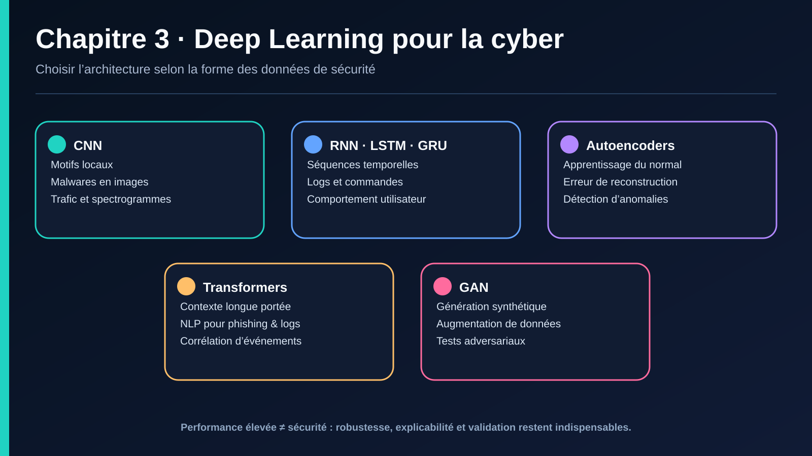

# III. DL POUR LA CYBERSÉCURITÉ

## III.1 Pourquoi le DL pour la cybersécurité ?

Le ML classique (chapitre II) atteint ses limites quand :
- les données sont **non structurées** ou très volumineuses (logs bruts, paquets réseau complets, code binaire, images de trafic) ;
- les **motifs d'attaque évoluent** et nécessitent une représentation apprise automatiquement plutôt que des features conçues manuellement (feature engineering) ;
- il faut modéliser des **dépendances séquentielles/temporelles** longues (une APT se déroule sur plusieurs mois — cf. I.1.c).

Le DL permet un **apprentissage de représentation (representation learning)** : au lieu de définir manuellement les features (comme en ML classique), le réseau apprend lui-même les représentations pertinentes à partir des données brutes.

## III.2 Architectures utiles en cybersécurité

### a. CNN (Convolutional Neural Networks)
Initialement conçus pour la vision, les CNN sont détournés en cybersécurité par une astuce : **transformer les données en « images »**.
- **Détection de malware par visualisation binaire** : le code exécutable est converti en image en niveaux de gris (chaque octet = un pixel), puis un CNN classifie l'image comme bénigne ou appartenant à une famille de malware. Les malwares d'une même famille produisent des motifs visuels similaires.
- **Classification de trafic réseau** : les paquets ou flux peuvent être représentés sous forme de matrices (image) pour être classifiés par CNN.
- **NLP côté sécurité** : Conv1D appliqué à des séquences de caractères ou de tokens (URLs, logs) pour détecter des motifs locaux suspects (ex. patterns d'injection SQL).

### b. RNN, LSTM, GRU
Adaptés aux données **séquentielles** : une session réseau, une séquence de commandes, un flux de logs dans le temps.
- **Détection d'intrusion basée sur les séquences** : modéliser une session utilisateur comme une séquence d'appels système ou de requêtes, et détecter les déviations par rapport aux séquences normales.
- **Analyse de logs** : les LSTM sont utilisés pour apprendre la structure normale des logs système (ex. DeepLog) et signaler les séquences anormales, sans besoin de règles écrites manuellement.
- **Détection de DGA (Domain Generation Algorithm)** : les LSTM classifient des noms de domaine caractère par caractère pour détecter les domaines générés algorithmiquement par des malwares (technique d'évasion des botnets).

### c. Autoencoders
Réseau entraîné à reconstruire son entrée en passant par une représentation compressée (goulot d'étranglement). Entraîné **uniquement sur du trafic normal**, il reconstruit mal tout ce qui s'écarte de la normale — l'erreur de reconstruction devient un score d'anomalie.
- **Usage** : détection d'anomalies non supervisée, particulièrement adaptée quand les attaques sont rares ou inconnues (zero-day, cf. I.1.c).
- **Variational Autoencoders (VAE)** *(complément)* : version probabiliste, utile pour modéliser l'incertitude et générer des échantillons synthétiques d'entraînement.

### d. Transformers *(complément important)*
Architecture devenue dominante depuis 2020, initialement pour le NLP (traduction, LLM), aujourd'hui appliquée à la cybersécurité :
- **Analyse de logs et de séquences longues** — le mécanisme d'attention capture des dépendances à longue portée mieux que les LSTM, utile pour repérer une APT qui se déroule sur des milliers d'événements.
- **Analyse de code / détection de vulnérabilités** — modèles de type CodeBERT analysant du code source pour repérer des patterns vulnérables.
- **Classification de contenu de phishing/e-mail** — modèles de langage (type BERT) analysant le contenu textuel d'un e-mail pour détecter des indices linguistiques de phishing plus fins que le simple filtrage par mots-clés.

### e. GANs (Generative Adversarial Networks) *(complément)*
Deux réseaux (générateur / discriminateur) s'entraînent en compétition. En cybersécurité :
- **Usage défensif** : génération de données synthétiques d'attaques pour enrichir des jeux de données déséquilibrés (alternative à SMOTE pour les données complexes).
- **Usage offensif** *(voir chapitre IV)* : génération de malwares adverses capables de contourner un détecteur, ou de deepfakes pour l'ingénierie sociale.

## III.3 Études de cas

### Cas 1 — Détection d'intrusion (IDS) par Autoencoder
Un autoencoder est entraîné exclusivement sur des flux réseau normaux (ex. CICIDS2017, sous-ensemble bénin). En production, chaque nouveau flux est passé dans l'autoencoder ; si l'erreur de reconstruction dépasse un seuil, le flux est signalé comme anomalie potentielle. Avantage clé : détecte des attaques **jamais vues à l'entraînement** (contrairement à un classifieur supervisé).

### Cas 2 — Détection de malware par CNN sur image binaire
Les fichiers exécutables (`.exe`) sont convertis en images en niveaux de gris de taille fixe. Un CNN (architecture proche de LeNet/ResNet simplifié) est entraîné à classifier ces images par famille de malware. Résultats : performances proches ou supérieures aux approches à base de signatures pour détecter des variantes d'une même famille (polymorphisme).

### Cas 3 — Analyse de logs par LSTM (type DeepLog)
Les logs système sont transformés en séquences de « clés de log » (templates d'événements). Un LSTM apprend la séquence normale des événements système. Toute séquence qui s'écarte significativement du modèle appris (probabilité faible du prochain événement observé) déclenche une alerte — sans qu'aucune règle SIEM n'ait été écrite manuellement.

### Cas 4 — Classification de trafic chiffré
Avec la généralisation de TLS, l'inspection profonde de paquets (DPI) classique devient impossible sur le contenu chiffré. Des modèles DL (souvent CNN ou LSTM) classifient le trafic à partir de métadonnées observables même sous chiffrement : taille des paquets, timing entre paquets, séquence de tailles — une approche appelée **traffic fingerprinting**.

## À retenir — Chapitre III
- Le DL est pertinent quand les données sont non structurées, volumineuses, ou nécessitent une modélisation séquentielle/temporelle.
- CNN → données transformées en « image » (malware, trafic) ; RNN/LSTM → séquences (logs, sessions) ; Autoencoders → détection d'anomalies non supervisée ; Transformers → dépendances longues et NLP de sécurité.
- Le DL améliore la détection de menaces inconnues (zero-day) via l'apprentissage de représentation, au prix d'une interprétabilité réduite — d'où l'importance de l'explicabilité (XAI, voir IV et V).

---

---

## Navigation

[← Chapitre 2](./02-ml-pour-la-cybersecurite.md) · [Sommaire](../README.md) · [Chapitre 4 →](./04-ia-offensive-defensive.md)

> Source pédagogique : support « IA pour la cybersécurité » — Dr. HONNIT Bouchra. Mise en forme Markdown et illustration de synthèse ajoutées pour ce dépôt.
