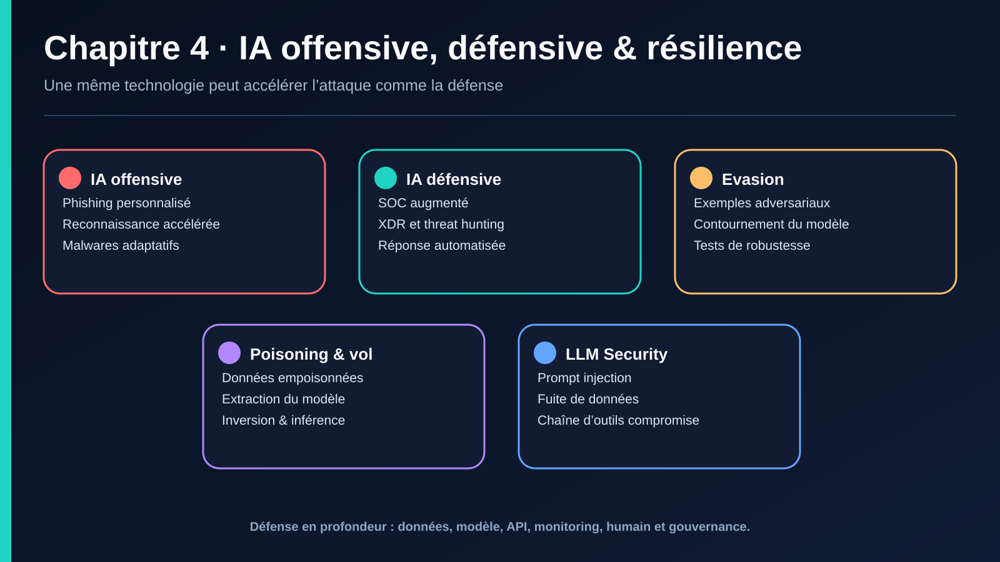

# IV. IA OFFENSIVE, DÉFENSIVE ET RÉSILIENCE DES SYSTÈMES INTELLIGENTS

## IV.1 IA pour les cyberattaques (IA offensive)

L'IA n'est pas seulement un outil défensif : elle abaisse le coût et augmente l'échelle des cyberattaques.

| Usage offensif de l'IA | Description |
|---|---|
| **Phishing généré par IA** | Des LLM génèrent des e-mails de spear phishing personnalisés, grammaticalement parfaits, dans la langue et le style de l'organisation ciblée — à grande échelle et à faible coût. |
| **Deepfakes** | Vidéos/audios synthétiques imitant un dirigeant pour tromper un employé (variante IA du Whale Phishing, cf. I.1.c) — des fraudes au « faux CEO » par deepfake vocal ou vidéo ont déjà causé des pertes de plusieurs millions de dollars à des entreprises. |
| **Malware polymorphe généré par IA** | Génération automatique de variantes de code malveillant pour échapper aux signatures antivirus (mutation continue). |
| **Reconnaissance automatisée (OSINT augmenté)** | Des agents IA collectent et croisent automatiquement des informations publiques pour préparer une attaque ciblée (spear phishing, social engineering) plus rapidement qu'un humain. |
| **Cracking de mots de passe assisté par IA** | Des modèles de langage entraînés sur des fuites de mots de passe génèrent des candidats plus pertinents que les règles classiques (dictionnaires, règles de mutation). |
| **Attaques automatisées / agentic AI** | Agents IA autonomes capables d'enchaîner reconnaissance, exploitation et exfiltration avec une supervision humaine minimale — une tendance émergente activement surveillée par les frameworks comme MITRE ATLAS (voir IV.3). |

## IV.2 IA pour la défense

### a. Security Operations Center (SOC) augmenté par l'IA
- **Triage automatique des alertes** — un modèle ML/DL priorise les milliers d'alertes SIEM quotidiennes selon leur probabilité d'être une vraie menace, réduisant l'« alert fatigue » (cf. II.4).
- **SOAR (Security Orchestration, Automation and Response)** — automatise les réponses à des scénarios connus (isoler une machine, bloquer une IP) une fois une menace confirmée par l'IA.
- **UEBA (User and Entity Behavior Analytics)** — modélise le comportement normal de chaque utilisateur/machine (cf. clustering, II.3.f) pour détecter les déviations (compte compromis, menace interne).
- **Threat Hunting assisté** — des copilotes IA (souvent basés sur des LLM) aident les analystes à formuler des requêtes de recherche de menaces en langage naturel sur les données SIEM, et à résumer automatiquement les investigations.

### b. XDR (Extended Detection and Response)
Extension du concept d'EDR (Endpoint Detection and Response) : corrèle les signaux de plusieurs sources (endpoint, réseau, cloud, e-mail) via des modèles ML/DL pour détecter des attaques qui ne seraient pas visibles en observant une seule source isolément.

### c. Détection de deepfakes
Des modèles DL (souvent CNN sur images/vidéo, ou analyse spectrale sur l'audio) sont spécifiquement entraînés à repérer les artefacts de génération (incohérences de clignement des yeux, artefacts fréquentiels de synthèse vocale) pour contrer les usages offensifs listés en IV.1.

### d. Threat Intelligence augmentée par l'IA
Des modèles NLP analysent en continu les sources ouvertes (forums, dark web, CVE, réseaux sociaux) pour détecter automatiquement l'émergence de nouvelles menaces, avant même leur exploitation massive.

## IV.3 Attaques contre les IA (Adversarial Machine Learning)

C'est le pendant du « lien négatif » évoqué en I.2.e : les modèles d'IA de sécurité sont eux-mêmes des cibles. Le référentiel de référence pour cataloguer ces menaces est **MITRE ATLAS** (Adversarial Threat Landscape for Artificial-Intelligence Systems), équivalent de MITRE ATT&CK pour l'IA.

### a. Attaques adversariales (evasion attacks)
Perturbations imperceptibles ajoutées à une entrée pour tromper un modèle déjà entraîné, sans modifier le modèle lui-même.
- **Exemple classique** : ajouter un bruit calculé à une image pour qu'un CNN la classe incorrectement, alors que l'image paraît identique à l'œil humain.
- **En cybersécurité** : modifier légèrement un binaire malveillant (ajout d'octets inoffensifs, réorganisation de sections) pour qu'un détecteur de malware par CNN (cf. III.2.a) le classe comme bénin, tout en conservant le comportement malveillant.
- **Prompt injection** *(spécifique aux LLM)* : instructions cachées dans un contenu (document, page web, e-mail) visant à détourner le comportement d'un LLM/agent IA — un enjeu de sécurité central pour les copilotes SOC (IV.2.a).

### b. Data poisoning (empoisonnement des données)
Corruption des données d'entraînement pour dégrader ou biaiser un modèle avant même son déploiement.
- **Exemple** : injecter de faux exemples « bénins » ressemblant à des attaques réelles dans le jeu d'entraînement d'un IDS, pour créer un point aveugle exploitable ensuite.
- Particulièrement critique pour les modèles réentraînés en continu (online learning) sur des données de production non filtrées.

### c. Model extraction / model stealing
Un attaquant interroge massivement un modèle en production (via son API) pour reconstruire un modèle de substitution qui en imite le comportement — permettant ensuite de préparer des attaques adversariales hors ligne, ou de voler la propriété intellectuelle du modèle.

### d. Model inversion / membership inference
- **Model inversion** — reconstruire des données d'entraînement sensibles à partir des sorties du modèle (risque de confidentialité, cf. chapitre V).
- **Membership inference** — déterminer si un enregistrement spécifique faisait partie du jeu d'entraînement, ce qui peut révéler des informations personnelles (ex. si les données d'entraînement d'un modèle médical contenaient les données d'un individu précis).

### e. Attaques spécifiques aux LLM / IA générative
- **Jailbreaking** — contourner les garde-fous de sécurité/éthique d'un LLM via des formulations de prompt spécifiques.
- **Prompt injection indirecte** — instructions malveillantes cachées dans un contenu que le LLM va lire (document, résultat de recherche), plutôt que dans le prompt direct de l'utilisateur.
- **Empoisonnement de la chaîne d'approvisionnement IA (AI supply chain)** — modèles pré-entraînés téléchargés depuis des dépôts publics (Hugging Face, etc.) contenant du code malveillant ou des biais intentionnels.

### Panorama des contre-mesures

| Menace | Contre-mesure principale |
|---|---|
| Attaques adversariales (evasion) | Adversarial training (entraîner le modèle avec des exemples adversariaux), détection d'anomalies sur les entrées, ensembles de modèles |
| Data poisoning | Validation/traçabilité des données d'entraînement, détection d'outliers avant entraînement, apprentissage robuste |
| Model extraction | Limitation du taux de requêtes (rate limiting), watermarking de modèle, détection de patterns de requêtes suspects |
| Model inversion / membership inference | Differential privacy (voir chapitre V), réduction de la précision des sorties exposées |
| Prompt injection / jailbreaking | Filtrage des entrées/sorties, séparation stricte instructions/données, tests de red teaming réguliers (cf. OWASP LLM Top 10) |

## À retenir — Chapitre IV
- L'IA abaisse le coût des attaques (phishing personnalisé, deepfakes, malware polymorphe) tout en démultipliant les capacités défensives (SOC augmenté, XDR, threat hunting).
- Les modèles d'IA sont eux-mêmes des surfaces d'attaque : MITRE ATLAS structure ces menaces (evasion, poisoning, extraction, inversion, attaques LLM).
- La résilience d'un système IA de sécurité nécessite des contre-mesures spécifiques, distinctes de la sécurité applicative classique.

---

---

## Navigation

[← Chapitre 3](./03-dl-pour-la-cybersecurite.md) · [Sommaire](../README.md) · [Chapitre 5 →](./05-vie-privee-et-rgpd.md)

> Source pédagogique : support « IA pour la cybersécurité » — Dr. HONNIT Bouchra. Mise en forme Markdown et illustration de synthèse ajoutées pour ce dépôt.
