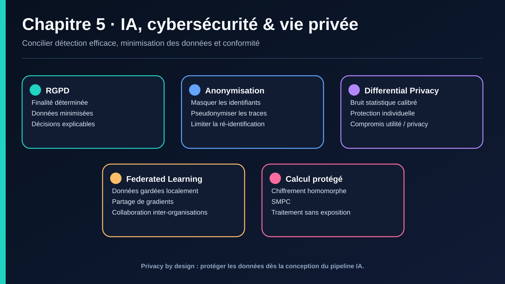

# V. IA, CYBERSÉCURITÉ & PROTECTION DE LA VIE PRIVÉE

## V.1 Confidentialité & RGPD

### a. Rappel des principes RGPD pertinents pour l'IA
Le Règlement Général sur la Protection des Données (RGPD, UE, 2018) encadre tout traitement de données personnelles, y compris par des systèmes d'IA/ML de cybersécurité (logs contenant des adresses IP, identifiants utilisateurs, comportements).

| Principe RGPD | Implication pour un système IA de sécurité |
|---|---|
| Minimisation des données | Ne collecter/conserver que les données réellement nécessaires à la détection de menaces |
| Limitation de la finalité | Les logs collectés pour la sécurité ne peuvent pas être réutilisés librement pour d'autres finalités (ex. évaluation RH) |
| Droit à l'explication *(lié à l'art. 22)* | Une décision automatisée à fort impact (ex. blocage automatique d'un compte) doit pouvoir être expliquée — lien direct avec l'explicabilité évoquée en I.2.b et II.4 |
| Privacy by design | La protection des données doit être pensée dès la conception du pipeline ML (cf. II.2), pas ajoutée après coup |
| Droit à l'effacement | Complexe pour les modèles ML : un modèle entraîné sur des données personnelles « mémorise » potentiellement ces données (cf. model inversion, IV.3.d) — d'où l'émergence du **machine unlearning** |

### b. Tension structurelle : sécurité vs vie privée
La cybersécurité nécessite souvent une **surveillance étendue** (logs détaillés, comportements utilisateurs, contenus d'e-mails) pour détecter les menaces — ce qui entre en tension directe avec les principes de minimisation des données du RGPD. Les architectures de sécurité modernes doivent arbitrer explicitement entre :
- **couverture de détection maximale** (plus de données = meilleure détection, cf. chapitres II-III) ;
- **respect de la vie privée** (minimisation, anonymisation, durée de conservation limitée).

## V.2 IA & Privacy-Enhancing Technologies (PET)

Ces technologies permettent de concilier performance des modèles IA et protection de la vie privée.

### a. Anonymisation et pseudonymisation
- **Anonymisation** — suppression irréversible du lien entre une donnée et une personne (ex. suppression complète des adresses IP dans les logs analysés).
- **Pseudonymisation** — remplacement des identifiants directs par des identifiants indirects réversibles sous conditions (utile pour investiguer un incident tout en limitant l'exposition au quotidien).
- **Limite en ML** : l'anonymisation naïve peut être contournée par ré-identification en croisant plusieurs sources de données (attaque de corrélation) — d'où le recours à des techniques plus robustes ci-dessous.

### b. Differential Privacy (confidentialité différentielle)
Ajoute un bruit statistique calibré aux données ou aux résultats d'un modèle, garantissant mathématiquement qu'aucune conclusion précise ne peut être tirée sur un individu spécifique, tout en préservant les tendances statistiques globales utiles à la détection de menaces.
- **Usage en cybersécurité** : publier des statistiques agrégées sur les incidents de sécurité sans exposer d'utilisateurs individuels ; entraîner des modèles ML avec garanties de confidentialité (DP-SGD — Differentially Private Stochastic Gradient Descent), en contre-mesure directe au **model inversion** (IV.3.d).

### c. Federated Learning (apprentissage fédéré)
Le modèle est entraîné localement sur chaque appareil/organisation (les données ne quittent jamais leur environnement d'origine) ; seuls les paramètres du modèle (gradients) sont partagés et agrégés centralement.
- **Usage en cybersécurité** : plusieurs organisations (ex. banques, opérateurs télécom) collaborent pour entraîner un détecteur de fraude/malware commun plus performant, sans jamais partager leurs données brutes sensibles entre elles — un enjeu particulièrement pertinent pour de la threat intelligence mutualisée.

### d. Chiffrement homomorphe (Homomorphic Encryption)
Permet d'effectuer des calculs directement sur des données chiffrées, sans jamais les déchiffrer — le résultat du calcul, une fois déchiffré, est identique à celui obtenu sur les données en clair.
- **Usage** : exécuter un modèle de détection de menace sur des données chiffrées hébergées par un tiers (cloud), sans jamais exposer les données en clair au fournisseur cloud. Coût de calcul encore élevé, en progression rapide.

### e. Secure Multi-Party Computation (SMPC) *(complément)*
Plusieurs parties calculent conjointement une fonction sur leurs données privées respectives sans qu'aucune partie ne révèle ses données aux autres — utile pour du partage de threat intelligence entre organisations concurrentes.

### Tableau de synthèse

| Technologie | Protège contre | Coût principal |
|---|---|---|
| Anonymisation/pseudonymisation | Exposition directe des identifiants | Risque de ré-identification par corrélation |
| Differential Privacy | Model inversion, membership inference | Perte de précision statistique (compromis privacy/utility) |
| Federated Learning | Centralisation de données sensibles | Complexité d'infrastructure, attaques possibles sur les gradients partagés |
| Chiffrement homomorphe | Exposition des données à un tiers de calcul | Coût de calcul très élevé |
| SMPC | Partage de données entre parties non-confiantes | Complexité protocolaire, latence |

## V.3 Cadres réglementaires complémentaires (2025-2026)

- **RGPD (UE)** — cadre de référence pour les données personnelles, applicable à tout traitement IA sur des données européennes.
- **EU AI Act** — règlement européen sur l'IA, avec des obligations renforcées pour les systèmes d'IA « à haut risque » (dont certains usages de sécurité) ; échéances de mise en conformité pour les systèmes à haut risque en 2026.
- **NIST AI Risk Management Framework (AI RMF)** — cadre américain de gestion des risques IA, incluant un profil spécifique pour l'IA générative (NIST AI 600-1).
- **ISO/IEC 42001** — norme internationale de système de management de l'IA, avec les premières certifications d'organisations apparaissant en 2025-2026.
- **OWASP Top 10 for LLM Applications** — référentiel des vulnérabilités spécifiques aux applications basées sur des LLM (prompt injection, data poisoning, etc.), complémentaire à MITRE ATLAS (cf. IV.3).

## À retenir — Chapitre V
- La cybersécurité par l'IA repose sur la collecte de données souvent sensibles, ce qui crée une tension structurelle avec le RGPD et les principes de minimisation.
- Les Privacy-Enhancing Technologies (differential privacy, federated learning, chiffrement homomorphe, SMPC) permettent de concilier performance de détection et protection de la vie privée.
- Le cadre réglementaire (RGPD, EU AI Act, NIST AI RMF, ISO/IEC 42001) structure de plus en plus les obligations de gouvernance IA en contexte de sécurité.

---

---

## Navigation

[← Chapitre 4](./04-ia-offensive-defensive.md) · [Sommaire](../README.md) · [Retour au sommaire](../README.md)

> Source pédagogique : support « IA pour la cybersécurité » — Dr. HONNIT Bouchra. Mise en forme Markdown et illustration de synthèse ajoutées pour ce dépôt.
