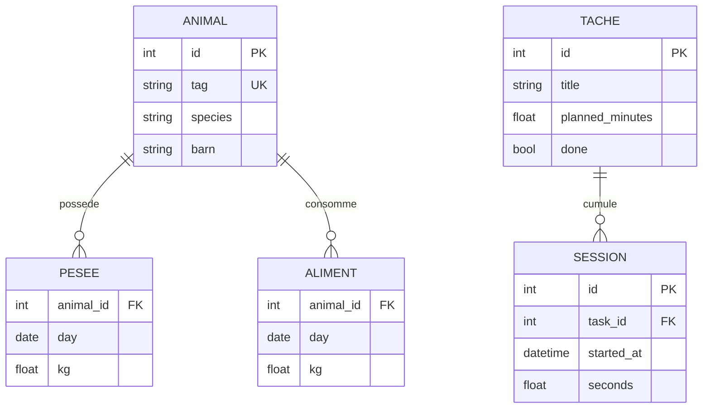

# Projet de fin de module

## Application industrielle de gestion de projet d'élevage animal connecté

### Commande pédagogique

Vous intervenez comme équipe de développement d'un atelier d'élevage. Le responsable veut regrouper les observations d'animaux, suivre le temps des activités, détecter des écarts et disposer d'une aide à l'analyse. Le premier livrable doit fonctionner sur un poste sans connexion permanente. Un futur déploiement industriel pourra ajouter réseau, comptes et matériel.

**Livrable fourni :** [application locale complète](projet-elevage/README.md), code source, données synthétiques, tests et documentation. **Travail demandé à l'étudiant :** comprendre cette base, la démontrer, puis réaliser une extension évaluée. Ne pas présenter une fonctionnalité annoncée comme déjà développée.

## 1. Acteurs et usages

| Acteur | Besoin | Parcours |
|---|---|---|
| Responsable d'atelier | Suivre l'évolution du projet | Paramètres, tâches, écarts au temps prévu |
| Technicien | Saisir observations et temps | Animal, pesée, aliment, démarrage/arrêt de tâche |
| Analyste | Examiner indicateurs et hypothèses | Courbe, GMQ, IC, projection et export |
| Passerelle IoT | Fournir des observations structurées | CSV validé, identité de bâtiment, horodatage |

Le démonstrateur n'implémente pas de rôles d'accès ; ces acteurs décrivent les usages. L'authentification devient une exigence pour un futur service partagé.

## 2. Exigences fonctionnelles et critères d'acceptation

| ID | Exigence livrée | Vérification attendue |
|---|---|---|
| F01 | Créer un projet local et ses paramètres | Nom et seuils persistent au redémarrage |
| F02 | Enregistrer un animal identifié, espèce et bâtiment | Identifiant unique, champs non vides |
| F03 | Enregistrer poids et consommation journalière | Valeurs finies, dates valides, doublons rejetés |
| F04 | Calculer GMQ et indice de consommation | 100 → 108 kg en 10 j : 800 g/j ; 20 kg aliment : IC 2,5 |
| F05 | Définir tâches et budget de temps | Tâche ouverte, minutes prévues, clôture |
| F06 | Chronométrer les sessions | Une session active, cumul après arrêt, sauvegarde à fermeture normale |
| F07 | Simuler ou importer des capteurs | Unité, bâtiment, fuseau ; lot invalide entièrement annulé |
| F08 | Afficher alertes explicables | Seuil, valeur observée, fraîcheur et mesure à vérifier |
| F09 | Proposer une aide IA locale | Règles + OLS, n et RMSE affichés, pas de recommandation médicale |
| F10 | Exporter et documenter | CSV exploitable, README d'installation, tests reproductibles |

## 3. Modèle de données

Les clés composites pesée/aliment sont `(animal_id, day)`. La table `sensors` conserve bâtiment, instant UTC, température, humidité et source. Le bâtiment est un libellé partagé, pas encore une entité normalisée : l'extension multi-bâtiments devra introduire une table et des clés étrangères. `settings` conserve le nom du projet et les seuils. Une base correspond à un projet, sélectionné par `--db`.

## 4. Jalons et charge personnelle

| Jalon | Travail | Charge proposée | Livrable |
|---|---|---:|---|
| J1 — Cadrage | User stories, contrats, unités et UML | 3 h | Spécification courte + résultats manuels |
| J2 — Domaine | GMQ, IC, régression et cas limites | 4 h | Fonctions pures et tests |
| J3 — Données | SQLite, import, sauvegarde, démo | 4 h | Base de test persistante |
| J4 — Interface | Vues, formulaires, graphique, erreurs | 5 h | Parcours démontrable |
| J5 — Couplage | Temps, capteurs, assistant | 5 h | Scénario intégré et vidéo/captures |
| J6 — Livraison | Tests, rapport, README et soutenance | 3 h | Dossier reproductible |

Total : 24 h de travail personnel dédiées au projet, comprises dans les 42 h du syllabus.

## 5. Guide de conception avec assistants IA

L'étudiant reste responsable du résultat. Faire travailler un assistant sur un contrat limité, puis effectuer la vérification lui-même. Exemples de prompts professionnels :

**Analyse métier :** « Agis comme analyste fonctionnel. À partir des exigences F01–F10, rédige cinq scénarios Given/When/Then. Ne crée pas de seuils zootechniques normatifs. Énumère les unités et les données manquantes qui empêchent le calcul. »

**Développement :** « Implémente une fonction pure calculant l'IC sur [début, fin[. Refuse les poids non finis ; retourne None si un jour de consommation manque ou si le gain n'est pas positif. Fournis trois exemples numériques indépendants. Aucune interface ni accès au disque dans cette fonction. »

**Revue :** « Relis l'import CSV en supposant dates sans fuseau, doublons, humidité hors borne et échec à la dernière ligne. Montre où la transaction garantit l'atomicité. Signale seulement les défauts vérifiables et propose un test de régression. »

**Évaluation du modèle :** « Propose un protocole de validation chronologique pour une projection de poids. Compare à une baseline dernière valeur. Sépare RMSE d'ajustement et erreur sur futur inconnu ; explique ce que trois pesées ne permettent pas d'affirmer. »

**Documentation :** « Rédige un parcours d'installation depuis un poste neuf et un scénario de démonstration. Distingue les fonctions implémentées, les extensions et les dépendances matérielles. N'annonce aucun test non exécuté. »

Ces rôles décrivent une méthode de travail pédagogique ; ils n'imposent ni service payant ni automatisation externe.

## 6. Extension obligatoire au choix

Choisir une seule extension, la spécifier, puis ajouter tests et documentation :

- Correction d'une pesée avec motif, confirmation et historique d'audit.
- Priorisation des tâches à partir d'alertes, avec validation manuelle avant modification.
- API FastAPI réutilisant le domaine, authentification et tests de refus.
- Acquisition réelle depuis un capteur, file hors ligne et idempotence.
- Validation chronologique de la projection et comparaison formelle à la baseline.

Le périmètre doit rester démontrable. Une nouvelle dépendance doit répondre à un besoin explicite ; elle ne donne pas de points à elle seule.

## 7. Dossier à rendre et soutenance

Rendre le code, les dépendances, un jeu synthétique, les tests, un README, une note d'architecture, les résultats obtenus et les limites. Ne pas inclure environnement virtuel, base réelle ou secrets. La démonstration de 10 minutes doit montrer nominal, entrée invalide, fermeture/redémarrage et justification d'une décision technique.

Barème détaillé dans le [syllabus](SYLLABUS.md). Les indicateurs biologiques doivent être contextualisés par un professionnel avant exploitation. Les seuils et observations fournis ici servent à enseigner le développement et l'analyse.
