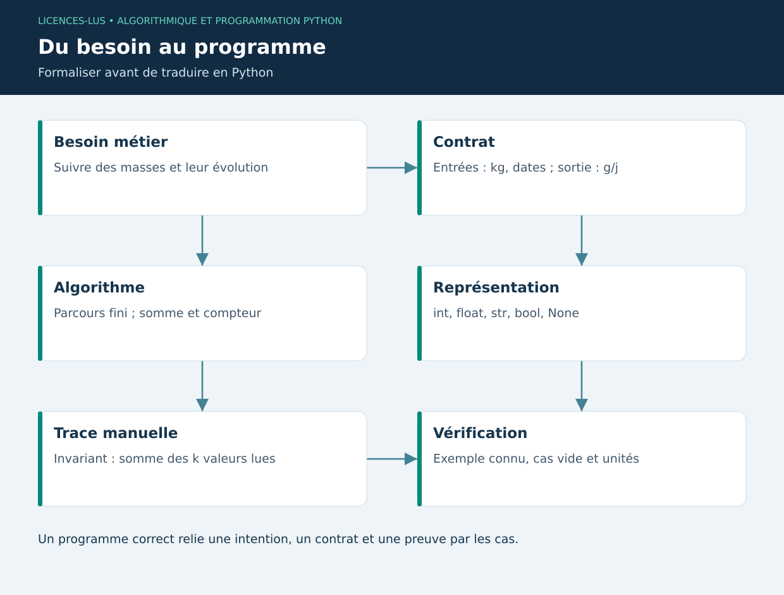

# 01 — Algorithmes, variables et types

[Sommaire](../README.md) · [Suivant](02-controle.md)

## Objectifs et situation

Transformer « suivre la croissance des animaux » en opérations calculables. À la fin, savoir définir un contrat, distinguer valeur et variable, manipuler les types usuels et expliquer la complexité d'un parcours.

Un **algorithme** est une procédure finie décrivant comment obtenir une sortie à partir d'entrées. Le programme est son expression dans un langage exécutable. Avant de coder, préciser : quelles données, quelles unités, quelles valeurs interdites et quel résultat attendu ? Pour un calcul de croissance, les entrées sont des poids positifs en kg et des dates distinctes ; la sortie est un gain en g/j, éventuellement négatif.

## Syntaxe et exécution

Python exécute les instructions d'un fichier de haut en bas. Les blocs sont délimités par l'indentation, généralement quatre espaces. `#` introduit un commentaire. Le symbole `=` associe un nom à un objet ; `==` compare deux valeurs. Les noms sont sensibles à la casse. Éviter de nommer une variable `list`, `str` ou `sum`, car ces noms désignent déjà des outils du langage.

```python
poids_kg = 180.5              # float
nombre_animaux = 12          # int
identifiant = "BOV-001"      # str
mesure_validee = True        # bool
temperature_absente = None   # absence, différente de zéro
poids_g = poids_kg * 1000
print(f"{identifiant} : {poids_g:.0f} g")
```

Le typage est dynamique : c'est l'objet qui porte son type. `poids_kg: float = 180.5` ajoute une annotation utile aux humains et aux analyseurs, mais ne valide pas automatiquement les données à l'exécution. `input()` renvoie une chaîne ; `float("180.5")` convertit, tandis que `float("180,5")` lève une exception. Une interface doit définir la convention de saisie.

| Type | Usage | Attention |
|---|---|---|
| `int` | Compteur, nombre entier | Division `/` produit un float |
| `float` | Mesure physique approchée | `0.1 + 0.2` n'est pas exactement `0.3` |
| `bool` | Résultat logique | `bool("False")` vaut True : chaîne non vide |
| `str` | Texte Unicode | Immuable, indexation à partir de zéro |
| `None` | Valeur absente | Tester avec `is None` |

Les opérateurs `+ - * / // % **` expriment somme, différence, produit, division, quotient entier, reste et puissance. Les parenthèses rendent les unités et priorités explicites. Pour comparer des résultats flottants, utiliser une tolérance (`math.isclose`) plutôt qu'une égalité stricte arbitraire.

## Raisonnement algorithmique

Pseudocode d'une masse moyenne : initialiser somme et compteur, parcourir les masses, valider chaque valeur, accumuler, puis diviser si le compteur n'est pas nul. L'invariant est « après k itérations, la somme contient exactement les k premières masses ». Un parcours de n valeurs coûte O(n) ; la somme et le compteur utilisent O(1) mémoire supplémentaire. Conserver toute la liste coûte O(n), même si l'accumulateur est constant.

```python
def moyenne(valeurs):
    if not valeurs:
        raise ValueError("La liste est vide")
    total = 0.0
    for valeur in valeurs:
        total += valeur
    return total / len(valeurs)

assert moyenne([100, 110, 120]) == 110
```

Cette première fonction suppose des valeurs numériques déjà validées ; le chapitre 3 renforcera son contrat. Distinguer la correction (bon résultat), la terminaison (le calcul s'arrête) et l'efficacité (ressources consommées).

## TP 01

Exécuter `python exemples/01_bases.py` depuis le dossier du module. Prévoir le résultat avant l'exécution. Ajouter un quatrième animal de 130 kg, calculer moyenne et conversion en grammes, puis expliquer ce qui se passe pour une liste vide. Produire une table de trace avec une ligne par itération et démontrer que le résultat est 115 kg.

**Critères :** unités dans les noms, cas vide traité, distinction `None`/zéro, justification de O(n). [Correction](../CORRIGES.md#tp-01).

**Référence :** [Tutoriel Python — introduction](https://docs.python.org/3/tutorial/introduction.html).

## Schéma de synthèse


