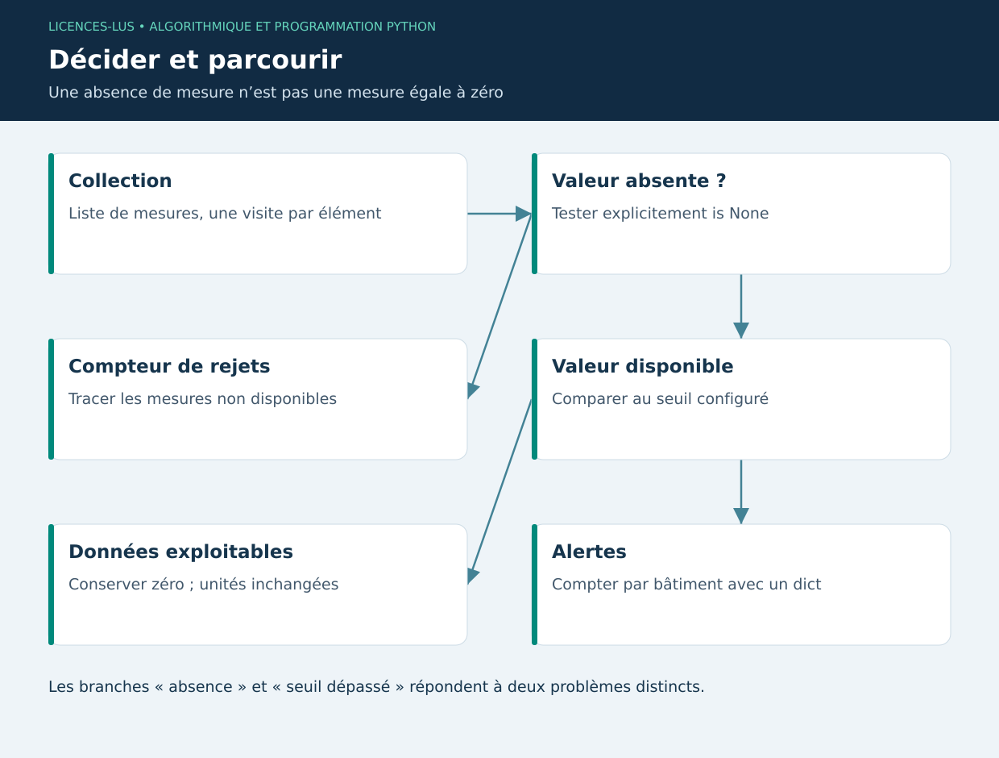

# 02 — Conditions, boucles et collections

[Précédent](01-fondamentaux.md) · [Sommaire](../README.md) · [Suivant](03-fonctions.md)

## Objectifs

Choisir une structure de contrôle, parcourir des collections et éviter les erreurs de bornes. Dans le projet, ces outils sélectionneront les mesures fiables avant le calcul des indicateurs.

## Conditions et logique

`if`, `elif`, `else` définissent des branches. Les opérateurs `and`, `or`, `not` combinent les prédicats. Python utilise l'évaluation court-circuitée : dans `x is not None and x > 30`, le second test n'est effectué que si x existe. Ce comportement permet de traiter explicitement les données absentes.

```python
temperature = None
if temperature is None:
    etat = "mesure absente"
elif temperature > 30:
    etat = "seuil pédagogique dépassé"
else:
    etat = "dans la plage configurée"
print(etat)
```

Ne pas écrire `if temperature` pour détecter une absence : 0 °C est une mesure valide mais fausse en contexte booléen. `a < b < c` réalise une comparaison chaînée. Les règles d'alerte doivent indiquer si la borne est incluse : ici 30 n'est pas strictement supérieur à 30.

## Boucles et terminaison

`for` parcourt un itérable ; `range(3)` produit 0, 1, 2. `while` répète tant qu'une condition reste vraie : il faut un état qui progresse vers la sortie. `break` termine la boucle et `continue` passe à l'itération suivante. Éviter une boucle `while True` dans le thread graphique : l'application ne traiterait plus ses événements.

```python
mesures = [None, 21.0, 31.5, 0.0, 29.0]
valides = []
for index, valeur in enumerate(mesures):
    if valeur is None:
        continue
    valides.append(valeur)
alertes = [x for x in valides if x > 30]
assert len(valides) == 4 and alertes == [31.5]
```

## Choisir une collection

| Structure | Propriété | Exemple et coût usuel |
|---|---|---|
| `list` | Ordonnée, mutable, doublons possibles | Historique ; recherche linéaire O(n) |
| `tuple` | Ordonnée, immuable | Coordonnées ou retour multiple |
| `dict` | Clés uniques, association clé → valeur | Animal par identifiant ; accès moyen O(1) |
| `set` | Valeurs uniques, non indexé | Détection de doublons ; appartenance moyenne O(1) |

Une affectation ne copie pas une liste : `b = a` crée deux noms pour le même objet. `b = a.copy()` réalise une copie superficielle ; les objets imbriqués restent partagés. Les dictionnaires conservent l'ordre d'insertion, mais cela ne signifie pas qu'ils trient les dates.

## Recherche et tri

Une recherche linéaire inspecte au plus n éléments. Une recherche dichotomique exige une collection déjà triée et réduit l'intervalle de moitié à chaque étape : O(log n). Le tri a lui-même un coût ; ne pas trier à chaque recherche sans raison. `sorted(pesees, key=lambda p: p[0])` retourne une nouvelle liste ; `.sort()` modifie la liste en place et retourne `None`.

## TP 02

Exécuter `python exemples/02_collections.py`. Construire un dictionnaire donnant le nombre de mesures supérieures à 30 °C par bâtiment. Pour `[('A', 31), ('B', 22), ('A', 33), ('B', None)]`, attendre `{'A': 2}`. Ajouter le nombre de données absentes séparément. Comparer un parcours unique à une boucle imbriquée bâtiment × mesure.

**Critères :** ne pas confondre absence et zéro, résultat indépendant de l'ordre, coût O(n), aucun écrasement involontaire de compteur. [Correction](../CORRIGES.md#tp-02).

**Références :** [Contrôle de flux](https://docs.python.org/3/tutorial/controlflow.html), [Structures de données](https://docs.python.org/3/tutorial/datastructures.html).

## Schéma de synthèse


