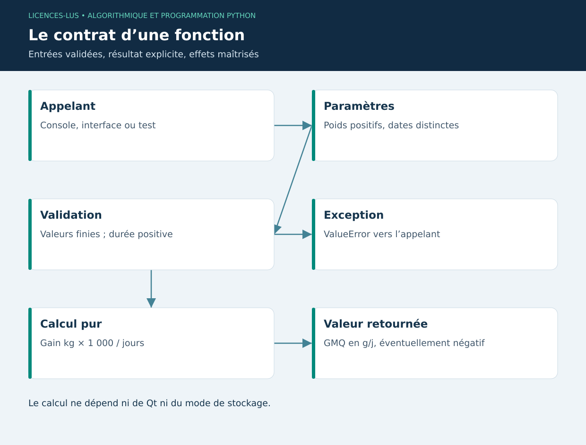

# 03 — Fonctions, modularité et contrats

[Précédent](02-controle.md) · [Sommaire](../README.md) · [Suivant](04-poo.md)

## Objectifs

Découper un programme en unités testables, distinguer paramètre et argument, valider les entrées et propager une erreur utile. La fonction GMQ sera réutilisée dans l'interface, les tests et l'assistant.

## Contrat d'une fonction

Une fonction reçoit des arguments, exécute son corps et retourne une valeur avec `return`. Sans `return`, elle renvoie `None`. `print()` est un effet d'affichage ; il ne remplace pas le résultat d'un calcul. Une fonction pure dépend seulement de ses entrées et ne modifie pas l'état extérieur : son résultat est facilement vérifiable.

```python
from math import isfinite

def gmq_simple(depart_kg: float, arrivee_kg: float, jours: int) -> float:
    """Calculer le gain moyen quotidien en grammes par jour."""
    if not all(isfinite(x) and x > 0 for x in (depart_kg, arrivee_kg)):
        raise ValueError("Poids positifs et finis requis")
    if jours <= 0:
        raise ValueError("La durée doit être strictement positive")
    return 1000 * (arrivee_kg - depart_kg) / jours

assert gmq_simple(180, 185.6, 7) == 1000 * (185.6 - 180) / 7
print(f"{gmq_simple(180, 185.6, 7):.1f} g/j")
```

Le type `int` annoncé ne rejette pas automatiquement 7.5 : la validation effective doit correspondre au contrat. Le projet évite cette ambiguïté en calculant une différence entre objets `date`, donc un nombre entier de jours. Il traite aussi une séquence de pesées au lieu de deux valeurs isolées.

## Paramètres et portée

`def alerte(valeur, seuil=30)` définit une valeur par défaut. Les arguments nommés rendent l'appel lisible : `alerte(31, seuil=32)`. Les valeurs par défaut sont évaluées une seule fois à la définition : utiliser `None` puis créer une liste dans la fonction, plutôt que `def f(items=[])`. Les noms locaux disparaissent à la fin de l'appel, mais les objets retournés peuvent subsister.

Une fonction peut recevoir une autre fonction : `sorted(mesures, key=...)`. Une petite expression peut utiliser `lambda`, mais une règle métier complexe mérite un nom et une docstring. Préférer plusieurs fonctions cohérentes à une fonction de 200 lignes qui lit le fichier, calcule, dessine et sauvegarde.

## Exceptions et modules

`raise ValueError` signale une entrée invalide. Le niveau appelant choisit la présentation : message dans une fenêtre, réponse HTTP ou échec de test. Intercepter une exception précise ; un `except: pass` cache aussi les défauts de programmation. Un bloc `finally` exécute un nettoyage, même après erreur.

Un fichier `.py` est un module. Le dossier `elevage/` est un paquet ; ses imports relatifs (`from .domain import gmq`) déclarent une dépendance interne. `if __name__ == '__main__':` distingue l'exécution directe d'un import, évitant de lancer une interface pendant les tests.

## TP 03

Exécuter `python exemples/03_fonctions.py`. Écrire `gmq_simple` puis trois appels : croissance, perte de poids, durée nulle. Le premier donne environ 800 g/j, le second peut être négatif et le troisième doit lever une erreur. Introduire `float('nan')` : pourquoi tester uniquement `poids > 0` ne suffit-il pas à une validation générale ? Utiliser des tests de finitude explicites.

**Critères :** aucun affichage dans le calcul, exception documentée, aucun seuil vétérinaire implicite, valeurs de référence calculées à la main. [Correction](../CORRIGES.md#tp-03).

**Références :** [Fonctions](https://docs.python.org/3/tutorial/controlflow.html#defining-functions), [Exceptions](https://docs.python.org/3/tutorial/errors.html).

## Schéma de synthèse


