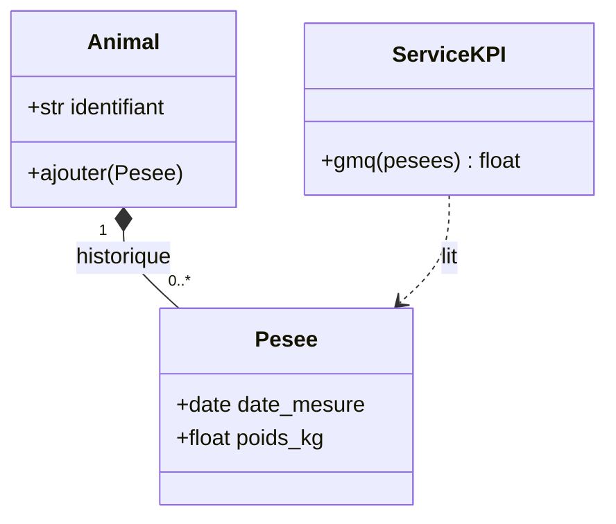
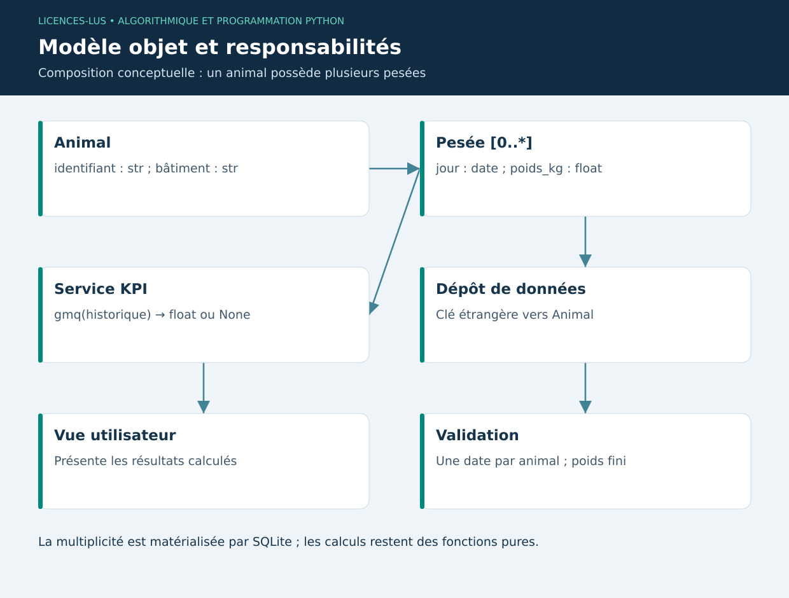

# 04 — Programmation orientée objet et modélisation UML

[Précédent](03-fonctions.md) · [Sommaire](../README.md) · [Suivant](05-qualite.md)

## Objectifs

Modéliser des entités et leurs relations, choisir composition ou héritage, séparer état et comportement. Le programme gère des animaux possédant des pesées ; il ne faut pas mélanger ces données à la fenêtre Qt.

## Classes et instances

Une **classe** décrit une structure et ses méthodes ; une **instance** représente un objet concret. `self` désigne l'instance recevant la méthode. `__init__` initialise son état. Les attributs de classe sont partagés, les attributs d'instance appartiennent à chaque objet. Placer une liste mutable au niveau de la classe pourrait partager l'historique entre tous les animaux.

```python
from dataclasses import dataclass, field
from datetime import date

@dataclass(frozen=True)
class Pesee:
    date_mesure: date
    poids_kg: float

@dataclass
class Animal:
    identifiant: str
    pesees: list[Pesee] = field(default_factory=list)

    def ajouter(self, pesee: Pesee) -> None:
        if pesee.poids_kg <= 0:
            raise ValueError("Poids positif requis")
        self.pesees.append(pesee)

a = Animal("BOV-001")
a.ajouter(Pesee(date(2026, 1, 1), 180))
assert len(Animal("BOV-002").pesees) == 0
```

`dataclass` génère notamment initialisation et représentation. `frozen=True` empêche la réaffectation normale des attributs mais n'est pas un mécanisme de sécurité. `default_factory=list` crée une liste distincte pour chaque animal.

## Relations et encapsulation

La composition exprime « possède un » : un animal possède zéro ou plusieurs pesées. L'héritage exprime « est un » et doit conserver le contrat du parent. Un capteur simulé et un capteur matériel peuvent offrir la même méthode `lire()` sans partager tout leur code. Le polymorphisme permet au consommateur de travailler sur ce contrat.

Un attribut `_connexion` indique par convention un détail interne ; Python n'impose pas une confidentialité absolue. Une propriété `@property` peut calculer une valeur sans l'enregistrer deux fois. Ne pas stocker GMQ et poids séparément sans stratégie d'invalidation : la valeur dérivée deviendrait périmée.



Le diagramme est conceptuel : dans le projet SQLite, la relation est matérialisée par une clé étrangère, et le service par des fonctions pures. Une classe par table n'est pas obligatoire. Le choix se justifie par la simplicité et les responsabilités, pas par le nombre de classes.

## TP 04

Exécuter `python exemples/04_objets.py`. Créer deux animaux, ajouter une pesée à l'un et vérifier que l'autre reste vide. Ajouter une règle refusant une date déjà présente. Dessiner la multiplicité entre projet, tâche et session de temps ; une tâche peut avoir plusieurs sessions.

**Critères :** état indépendant, composition explicite, aucun calcul dépendant de Qt, distinction identité d'un animal et valeur d'une pesée. [Correction](../CORRIGES.md#tp-04).

**Références :** [Classes Python](https://docs.python.org/3/tutorial/classes.html), [Dataclasses](https://docs.python.org/3/library/dataclasses.html).

## Illustration conceptuelle


