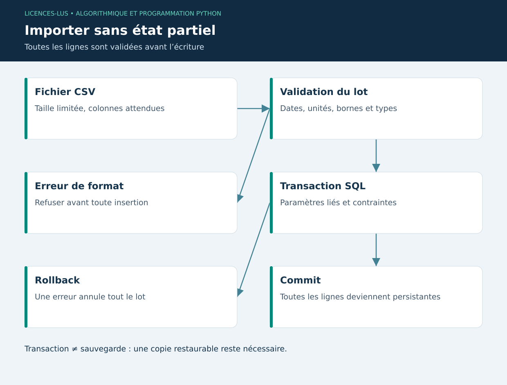

# 05 — Fichiers, bases de données et qualité logicielle

[Précédent](04-poo.md) · [Sommaire](../README.md) · [Suivant](06-data.md)

## Objectifs

Conserver l'information au-delà de l'exécution, détecter une entrée invalide et vérifier un comportement. Une application fiable distingue les erreurs de format, les règles métier et les incidents d'accès au disque.

## Formats et frontières

CSV représente une table ; JSON décrit des objets et listes imbriqués. Un CSV ne connaît ni types ni unités : le programme les impose. Les dates ISO 8601 évitent l'ambiguïté jour/mois ; un horodatage de capteur inclut son fuseau. `with open(..., encoding='utf-8', newline='')` ferme le fichier même en cas d'exception. Ne jamais remplacer une conversion impossible par zéro sans règle explicitée.

```python
import csv
from io import StringIO

source = StringIO("animal,poids_kg\nA,180.5\nB,190\n")
rows = list(csv.DictReader(source))
poids = [float(row["poids_kg"]) for row in rows]
assert poids == [180.5, 190.0]
```

Une valeur numérique doit aussi être finie : NaN et infini peuvent traverser un simple `float(...)`. Limiter la taille d'un import évite une consommation mémoire excessive. L'export vers un tableur doit neutraliser les cellules de texte commençant par un opérateur de formule ; le projet ajoute une apostrophe dans ce cas.

## SQLite et transactions

SQLite fournit une base relationnelle dans un fichier et convient à un poste local. La clé primaire identifie une ligne ; une clé étrangère relie une pesée à un animal existant ; la contrainte `UNIQUE(animal_id,day)` évite un doublon. L'activation `PRAGMA foreign_keys=ON` est nécessaire sur chaque connexion.

```python
import sqlite3

db = sqlite3.connect(":memory:")
try:
    db.execute("CREATE TABLE animal(id INTEGER PRIMARY KEY, nom TEXT UNIQUE)")
    with db:
        db.execute("INSERT INTO animal(nom) VALUES (?)", ("BOV-001",))
    assert db.execute("SELECT COUNT(*) FROM animal").fetchone()[0] == 1
finally:
    db.close()
```

Les `?` sont des paramètres liés : le pilote traite l'entrée comme une valeur, sans l'interpréter comme du SQL. Construire une requête avec une f-string contenant une saisie utilisateur est incorrect. `with db:` réalise un commit à la réussite ou un rollback en cas d'exception ; cela ne ferme pas la connexion. Valider tout le CSV avant insertion, puis insérer le lot dans une transaction, garantit l'atomicité.

## Tester et versionner

Un test unitaire vérifie un calcul isolé ; un test d'intégration vérifie SQLite ou Qt ; un scénario d'acceptation vérifie le parcours utilisateur. Un bon test utilise un résultat indépendant : pour 100 → 108 kg en 10 jours, on attend 800 g/j, et non une copie de la formule testée dans l'assertion.

`unittest` appartient à la bibliothèque standard. `assertAlmostEqual` gère les arrondis ; `assertRaises` vérifie l'erreur attendue. Un jeu utile contient chemin nominal, valeurs limites, données absentes et échec partiel. Le contrôle de syntaxe `compileall` ne prouve pas la correction du calcul.

Avec Git, isoler un changement cohérent, examiner `git diff`, puis créer un commit descriptif. Ne pas versionner clés API, base réelle ou environnement virtuel. Le fichier de dépendances décrit le démarrage ; les versions effectivement testées sont consignées dans le rapport de vérification.

## TP 05

Exécuter `python exemples/05_stockage.py`, puis les tests du projet. Préparer un CSV avec une ligne correcte et une humidité à 101 %. Vérifier qu'aucune mesure n'est ajoutée. Refaire avec deux lignes identiques et vérifier le rollback. Expliquer la différence entre transaction et sauvegarde.

**Critères :** requêtes paramétrées, fichier fermé, import atomique, tests sur base temporaire. [Correction](../CORRIGES.md#tp-05).

**Références :** [sqlite3](https://docs.python.org/3/library/sqlite3.html), [unittest](https://docs.python.org/3/library/unittest.html), [csv](https://docs.python.org/3/library/csv.html).

## Schéma de synthèse


