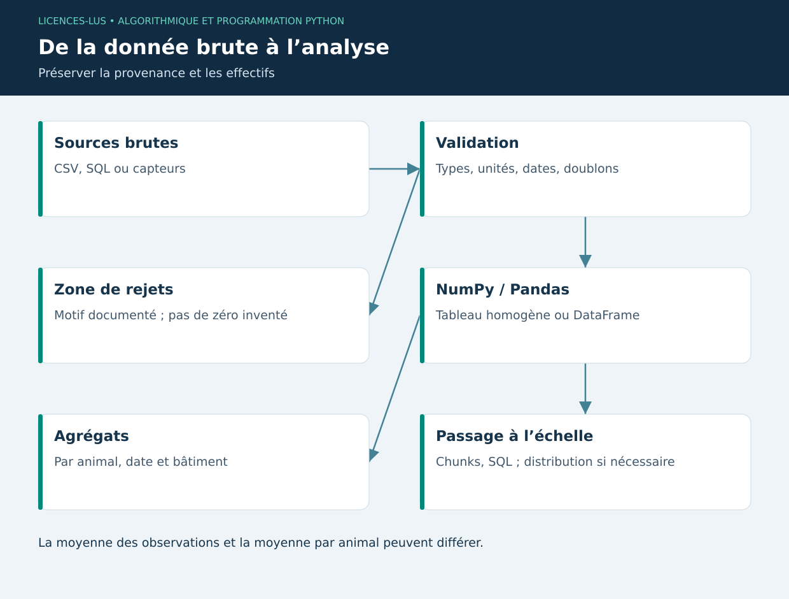

# 06 — Data Science et Big Data : NumPy et Pandas

[Précédent](05-qualite.md) · [Sommaire](../README.md) · [Suivant](07-visualisation.md)

## Objectifs

Choisir une représentation tabulaire, nettoyer sans altérer le sens métier et distinguer traitement vectorisé, lecture par blocs et calcul distribué.

## NumPy : tableaux et calcul vectorisé

Un `ndarray` possède une forme (`shape`) et un type homogène (`dtype`). Une matrice de trois animaux et quatre dates a une forme `(3,4)` ; les axes doivent être documentés. Une opération vectorisée exprime un calcul sur tout le tableau. Le broadcasting combine certaines formes compatibles : il faut contrôler les dimensions, car une diffusion involontaire peut produire une matrice au lieu d'un vecteur.

```python
import numpy as np

poids = np.array([[180, 185.6], [160, 161.75]], dtype=float)
gmq = (poids[:, 1] - poids[:, 0]) * 1000 / 7
assert np.allclose(gmq, [800, 250])
```

Les slices peuvent être des vues sur la mémoire originale. Utiliser `.copy()` lorsqu'une modification indépendante est attendue. `np.nan` représente une valeur manquante flottante ; `np.nanmean` l'ignore, mais ce choix doit être explicite et accompagné du nombre d'observations conservées.

## Pandas : données étiquetées

Un DataFrame associe lignes, colonnes et index. Convertir les dates avant de trier ; contrôler les doublons avant d'agréger ; vérifier les unités avant de joindre. Une jointure mal définie peut multiplier les lignes : `merge(..., validate='many_to_one')` exprime une hypothèse de cardinalité.

```python
import pandas as pd

df = pd.DataFrame({"animal": ["A", "A", "B"], "poids_kg": [180, 185.6, 160]})
resume = df.groupby("animal")["poids_kg"].agg(["count", "mean", "min", "max"])
print(resume)
```

La moyenne des poids de toutes les pesées favorise les animaux mesurés plus souvent. Pour une moyenne d'animaux, calculer d'abord une valeur représentative par animal. De même, la moyenne des GMQ individuels et le GMQ global pondéré répondent à des questions différentes.

## Nettoyage reproductible

Conserver une copie brute, produire un journal des rejets, séparer nettoyage et analyse. Une date manquante ne peut pas être interpolée arbitrairement. Une interpolation entre deux mesures n'est pas une nouvelle observation. Les valeurs extrêmes peuvent révéler un défaut de capteur ou un événement réel : les supprimer sans examen biaise le résultat.

## Passage à l'échelle

NumPy et Pandas ne sont pas des moteurs distribués par défaut. Lire un CSV de 30 Go dans 8 Go de RAM peut échouer. Commencer par sélectionner colonnes et types, agréger côté SQL, puis lire par blocs. Pour une moyenne globale, sommer les totaux et les effectifs de chaque bloc ; ne pas faire la moyenne non pondérée des moyennes.

```python
# Variante pour un gros fichier, non requise pour la démonstration.
# total, n = 0.0, 0
# for bloc in pd.read_csv("mesures.csv", usecols=["poids_kg"], chunksize=100_000):
#     s = pd.to_numeric(bloc["poids_kg"], errors="coerce").dropna()
#     total += s.sum(); n += s.size
# moyenne = total / n if n else None
```

Au-delà d'un poste, étudier Dask ou PySpark pour partitionner et distribuer ; prévoir coût réseau, sérialisation, shuffle et observabilité. Parquet organise les données par colonnes et conserve des types, avec un moteur supplémentaire tel que PyArrow. Choisir après mesure du volume et des performances, pas seulement à cause du mot « Big Data ».

## TP 06

Exécuter `python exemples/06_data.py`. Comparer moyenne de toutes les lignes et moyenne des moyennes par animal. Introduire une valeur manquante et compter les lignes rejetées. Justifier une jointure animal → bâtiment sans duplication.

**Critères :** cardinalités expliquées, unités conservées, effectifs affichés, stratégie mémoire documentée. [Correction](../CORRIGES.md#tp-06).

**Références :** [NumPy](https://numpy.org/doc/stable/user/quickstart.html), [Pandas](https://pandas.pydata.org/docs/getting_started/intro_tutorials/index.html).

## Schéma de synthèse


