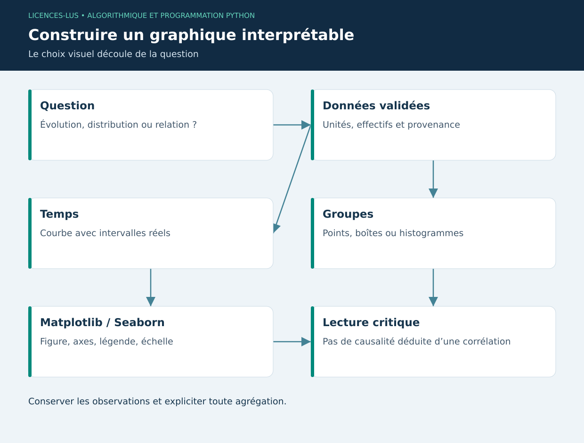

# 07 — Analyse et visualisation : Matplotlib et Seaborn

[Précédent](06-data.md) · [Sommaire](../README.md) · [Suivant](08-ml.md)

## Objectifs

Choisir un graphique selon la question, annoter unités et limites, puis produire un fichier reproductible. L'objectif est de rendre une comparaison juste, pas de multiplier les effets visuels.

## Analyse descriptive

Moyenne et médiane résument le centre ; écart-type et intervalle interquartile décrivent la dispersion. La médiane résiste mieux à un point extrême. Un histogramme dépend du nombre de classes ; une boîte à moustaches résume une distribution sans montrer nécessairement chaque observation. Sur petit effectif, superposer les points et indiquer n.

Une corrélation entre température et gain ne démontre pas de causalité. L'âge, l'alimentation et le bâtiment peuvent intervenir simultanément. Une série temporelle doit respecter les intervalles réels entre les dates ; placer chaque pesée à distance égale déforme une collecte irrégulière.

## Matplotlib : contrôle de la figure

L'API orientée objet sépare `Figure` (le document) et `Axes` (la zone de tracé). Définir un titre informatif, nommer les axes avec unités, utiliser une légende lorsqu'il y a plusieurs séries et limiter les couleurs.

```python
import matplotlib
matplotlib.use("Agg")  # export sans fenêtre
import matplotlib.pyplot as plt

fig, ax = plt.subplots(figsize=(7, 4))
ax.plot([0, 7, 14], [180, 185.6, 191.2], marker="o", label="BOV-001")
ax.set(xlabel="Temps depuis la première pesée (jours)", ylabel="Poids (kg)",
       title="Croissance observée — données synthétiques")
ax.legend(); ax.grid(alpha=0.2)
fig.tight_layout(); fig.savefig("croissance.png", dpi=160)
plt.close(fig)
```

Une courbe peut commencer au voisinage des poids observés si l'échelle est clairement lisible ; pour des barres comparant des amplitudes, une base zéro évite une exagération visuelle. Une bande d'incertitude ne doit pas être inventée : préciser son calcul et les hypothèses statistiques.

## Seaborn : grammaire statistique

Seaborn simplifie la liaison entre colonnes et attributs visuels : `x`, `y`, `hue`. Il s'appuie sur Matplotlib. Certaines fonctions agrègent automatiquement et calculent une incertitude ; pour les trajectoires individuelles, préciser l'agrégation ou la désactiver. `sns.scatterplot` conserve les observations ; `sns.boxplot` aide à comparer des groupes, avec prudence sur petits n.

## Intégration logicielle

Dans une application Qt, Matplotlib peut fournir un canvas intégré via son backend Qt. Le projet de base dessine la courbe directement avec `QPainter` afin de limiter ses dépendances à PyQt5. Les concepts restent identiques : transformation des dates en coordonnées, échelle des poids et mise à jour après nouvelle saisie.

Pour un rapport, PNG est pratique, SVG conserve une géométrie vectorielle. Exporter avant de fermer la figure ; enregistrer les paramètres et la provenance des données. Une palette accessible et des marqueurs distincts rendent le graphique utilisable sans perception parfaite des couleurs.

## TP 07

Exécuter `python exemples/07_visualisation.py`. Ouvrir les deux figures générées. Ajouter une pesée très éloignée des précédentes et commenter son influence sur la moyenne. Comparer une courbe chronologique à un nuage de points par bâtiment. Indiquer explicitement que les données sont synthétiques.

**Critères :** titre utile, axes/unité, légende, effectif et commentaire sur l'interprétation. [Correction](../CORRIGES.md#tp-07).

**Références :** [Matplotlib](https://matplotlib.org/stable/users/explain/quick_start.html), [Seaborn](https://seaborn.pydata.org/tutorial.html).

## Schéma de synthèse


