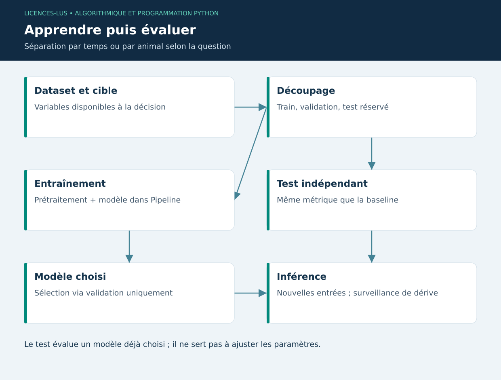

# 08 — Intelligence artificielle et Machine Learning avec scikit-learn

[Précédent](07-visualisation.md) · [Sommaire](../README.md) · [Suivant](09-deep-learning.md)

## Objectifs

Définir une cible, construire une baseline, isoler l'évaluation et expliquer une métrique. L'IA regroupe différentes approches ; le Machine Learning estime les paramètres d'un modèle à partir d'exemples. Un seuil programmé manuellement n'est pas un modèle appris.

## Régression, classification et données

Une régression prédit une quantité, par exemple un poids. Une classification prédit une classe, par exemple un état de capteur confirmé. Le clustering découvre des groupes sans étiquettes. Une anomalie statistique n'est pas automatiquement une maladie ni une panne.

Les features doivent exister au moment de la décision. Utiliser le poids final pour prédire ce même poids constitue une fuite de cible. Séparer par animal lorsqu'on évalue la généralisation à de nouveaux animaux ; séparer par temps pour une prévision future. Un mélange aléatoire de lignes d'un même individu peut créer une performance trompeuse.

## Pipeline et évaluation

```python
import numpy as np
from sklearn.pipeline import make_pipeline
from sklearn.preprocessing import StandardScaler
from sklearn.linear_model import Ridge
from sklearn.metrics import mean_absolute_error

x = np.arange(40, dtype=float).reshape(-1, 1)
y = 180 + 0.8 * x[:, 0] + np.sin(x[:, 0])
model = make_pipeline(StandardScaler(), Ridge(alpha=0.1))
model.fit(x[:30], y[:30])
prediction = model.predict(x[30:])
print("MAE test (kg) :", mean_absolute_error(y[30:], prediction))
```

Le scaler est appris exclusivement sur les données d'entraînement grâce au Pipeline. La **MAE** est la moyenne des erreurs absolues, exprimée ici en kg. Le **RMSE** pénalise davantage les grandes erreurs. Pour une classification rare, examiner précision, rappel et matrice de confusion ; une accuracy élevée peut simplement refléter la classe majoritaire.

Une baseline naïve peut prédire le dernier poids connu. Comparer sur exactement les mêmes observations. Pour sélectionner des hyperparamètres, utiliser une validation distincte ou une validation croisée adaptée au temps (`TimeSeriesSplit`). Conserver le test final pour une évaluation unique après sélection ; répéter les choix sur le test revient à apprendre indirectement dessus.

## Assistant du projet : portée réelle

La régression OLS du projet estime pente et intercept sur les jours écoulés. Elle est codée avec la bibliothèque standard pour rendre son calcul inspectable. L'assistant combine cette projection avec des règles sur le GMQ, la température et la fraîcheur des mesures. Il affiche le nombre de pesées et le RMSE **d'ajustement**.

Ce RMSE ne mesure pas la capacité à prévoir un élevage inconnu. La projection est locale, à court terme, sans intervalle de confiance. Une courbe de croissance réelle peut être non linéaire ; changement de ration, âge ou maladie peuvent invalider l'extrapolation. Le système propose une vérification humaine, pas une décision automatique.

## TP 08

Exécuter `python exemples/08_ml.py`. Comparer Ridge à la baseline « dernier poids d'entraînement ». Augmenter le bruit et relever les deux MAE. Faire une liste de features autorisées au jour t et de features qui utilisent le futur. Proposer un split par animal pour un second élevage.

**Critères :** aucune transformation ajustée sur le test, métrique avec unité, baseline, limite de généralisation formulée. [Correction](../CORRIGES.md#tp-08).

**Références :** [Pièges et bonnes pratiques scikit-learn](https://scikit-learn.org/stable/common_pitfalls.html), [Validation croisée](https://scikit-learn.org/stable/modules/cross_validation.html).

## Cycle d'apprentissage


