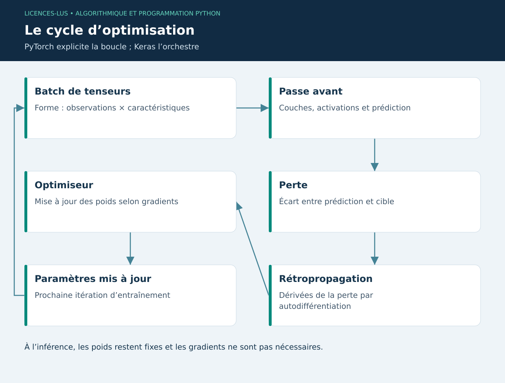

# 09 — Réseaux de neurones : PyTorch et TensorFlow

[Précédent](08-ml.md) · [Sommaire](../README.md) · [Suivant](10-cyber.md)

## Objectifs

Reconnaître un tenseur, suivre une passe avant/arrière et distinguer entraînement et inférence. Le Deep Learning devient pertinent pour images, signaux complexes ou grandes représentations ; un petit tableau de pesées ne justifie pas nécessairement un réseau profond.

## Du neurone au réseau

Un neurone calcule une combinaison pondérée puis une activation : `z = w·x + b`, `a = f(z)`. Plusieurs couches composent une fonction paramétrée. Une perte mesure l'écart à la cible ; la rétropropagation calcule les dérivées ; l'optimiseur ajuste les paramètres. Une époque parcourt l'entraînement, un batch en traite une partie. Le taux d'apprentissage règle l'amplitude de la mise à jour.

Un tenseur possède des axes, un type et un emplacement CPU/GPU. Pour un réseau dense de régression : entrée `(batch, features)`, sortie `(batch, 1)`. Une cible de forme `(batch,)` peut provoquer un broadcasting indésirable face à `(batch,1)` : vérifier les dimensions avant la perte.

## PyTorch : boucle explicite

```python
import torch
from torch import nn

torch.manual_seed(7)
x = torch.linspace(0, 1, 40).reshape(-1, 1)
y = 2 * x + 1
model = nn.Sequential(nn.Linear(1, 8), nn.Tanh(), nn.Linear(8, 1))
optimizer = torch.optim.Adam(model.parameters(), lr=0.03)
for _ in range(200):
    model.train()
    optimizer.zero_grad()
    loss = nn.functional.mse_loss(model(x[:30]), y[:30])
    loss.backward()
    optimizer.step()
model.eval()
with torch.no_grad():
    print("MAE test :", (model(x[30:]) - y[30:]).abs().mean().item())
```

`zero_grad()` remet les gradients à zéro ; leur accumulation involontaire modifie l'optimisation. `eval()` change le comportement de certaines couches telles que Dropout ; `no_grad()` évite la construction du graphe de gradients. Ces deux actions ont des rôles distincts.

## TensorFlow / Keras : orchestration déclarative

TensorFlow fournit calcul tensoriel et autodifférentiation ; Keras expose des couches, `compile` et `fit`. Le script `09_tensorflow.py` utilise le même jeu synthétique que l'exemple PyTorch, avec un sous-ensemble de validation distinct. L'appel central est :

```python
# Extrait ; le script complet importe TensorFlow et prépare x/y.
# model = tf.keras.Sequential([tf.keras.Input(shape=(1,)),
#     tf.keras.layers.Dense(8, activation="tanh"), tf.keras.layers.Dense(1)])
# model.compile(optimizer=tf.keras.optimizers.Adam(0.03), loss="mse")
# model.fit(x[:24], y[:24], validation_data=(x[24:30], y[24:30]),
#           epochs=200, verbose=0)
```

| Choix | Intérêt pédagogique | Vigilance |
|---|---|---|
| PyTorch | Boucle et gradients directement visibles | État train/eval, dimensions, device |
| TensorFlow/Keras | Entraînement déclaratif et outils intégrés | Versions, callbacks, pipeline de données |
| scikit-learn | Baseline tabulaire rapide | Prétraitement dans un Pipeline |

Ni l'un ni l'autre n'assure automatiquement une meilleure performance. Fixer une graine aide à reproduire une expérience, mais n'assure pas une identité bit à bit entre GPU, versions et systèmes. Documenter matériel, versions et split.

## TP 09

Installer **un seul backend à la fois dans un environnement dédié**, selon le README des exemples. Exécuter son script. Comparer au modèle linéaire du chapitre 8. Doubler le nombre d'unités, conserver le même split et relever l'erreur test sans sélectionner le meilleur essai à partir de ce test. Pourquoi une erreur d'entraînement quasi nulle ne prouve-t-elle pas la généralisation ?

**Critères :** forme des tenseurs, séparation validation/test, interprétation des erreurs, justification du modèle simple. [Correction](../CORRIGES.md#tp-09).

**Références :** [Optimisation PyTorch](https://docs.pytorch.org/tutorials/beginner/basics/optimization_tutorial.html), [Démarrage TensorFlow](https://www.tensorflow.org/tutorials/quickstart/beginner).

## Cycle de calcul


