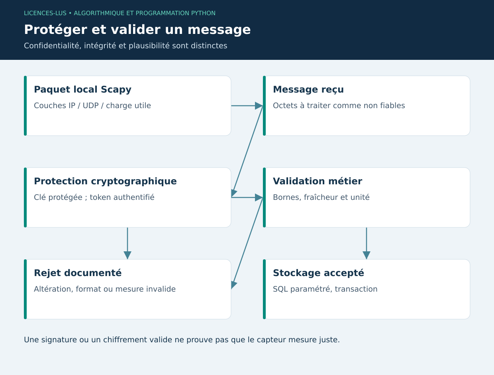

# 10 — Cybersécurité : Scapy et Cryptography

[Précédent](09-deep-learning.md) · [Sommaire](../README.md) · [Suivant](11-web.md)

## Objectifs

Comprendre la structure d'un paquet, analyser des données réseau autorisées et utiliser une primitive de chiffrement existante. Dans un élevage connecté, protéger l'identité du capteur et l'intégrité de ses mesures est aussi important que dessiner un tableau de bord.

## Scapy : représenter et analyser des protocoles

Scapy permet de construire, décoder et manipuler des paquets. L'opérateur `/` assemble des couches. Le TP construit des paquets en mémoire : aucune émission, capture active ou exploration réseau n'est nécessaire.

```python
from scapy.all import IP, UDP, Raw

paquet = IP(src="192.0.2.10", dst="192.0.2.20") / UDP(sport=12000, dport=12001) / Raw(b"temperature=24.5")
octets = bytes(paquet)
decode = IP(octets)
assert decode[UDP].dport == 12001
print(decode.summary())
```

Les adresses sont des exemples documentaires. Sur un fichier PCAP autorisé, `rdpcap` peut inspecter un petit volume ; `PcapReader` permet une lecture itérative. Conserver uniquement les champs nécessaires à l'analyse et protéger les captures contenant des informations sensibles. Les fonctions d'envoi et de capture demandent un périmètre de laboratoire autorisé ; elles ne font pas partie de ce TP.

## Confidentialité, intégrité et authenticité

Le chiffrement protège le contenu ; l'authentification du message détecte une altération avec la bonne clé. Un hash seul ne prouve pas l'origine d'un message. Une clé ne doit être ni inscrite dans Git ni affichée dans les journaux. Pour des communications réseau réelles, privilégier TLS et une authentification des clients ; ne pas inventer un protocole cryptographique.

```python
from cryptography.fernet import Fernet, InvalidToken

cle = Fernet.generate_key()  # clé éphémère du TP, uniquement en mémoire
coffre = Fernet(cle)
token = coffre.encrypt(b'{"temperature":24.5}')
assert coffre.decrypt(token) == b'{"temperature":24.5}'
try:
    coffre.decrypt(b"jeton-invalide")
except InvalidToken:
    print("Message rejeté")
```

Fernet combine chiffrement et authentification dans un format défini. Sa date de création n'est pas cachée. Générer une nouvelle clé à chaque démarrage empêcherait de relire les anciens messages : une application réelle requiert une conservation protégée et une rotation. Le TP n'écrit volontairement aucune clé sur disque.

## Sécurité de l'application finale

Les saisies sont validées avant stockage ; les requêtes SQL utilisent des paramètres ; les imports sont limités en taille et atomiques. L'export CSV neutralise les formules provenant des champs texte. Les données capteurs sont des entrées non fiables : même un message correctement chiffré peut contenir une température impossible ou une date périmée.

Le projet fonctionne sur un poste local sans serveur exposé. Son stockage n'est pas chiffré et ne gère pas des comptes utilisateurs ; une mise en production doit traiter contrôle d'accès du poste, sauvegardes, journal d'audit et protection des données. Ces propriétés sont des exigences d'extension explicites.

## TP 10

Exécuter `python exemples/10_cyber.py`. Modifier un octet du token puis vérifier que le déchiffrement échoue. Identifier IP source, port destination et charge utile du paquet local. Expliquer pourquoi « message authentifié » n'implique pas « mesure physiquement correcte ».

**Critères :** aucune émission réseau, pas de clé persistée, exception d'intégrité vérifiée, frontière de confiance identifiée. [Correction](../CORRIGES.md#tp-10).

**Références :** [Scapy](https://scapy.readthedocs.io/en/latest/usage.html), [Fernet](https://cryptography.io/en/latest/fernet/).

## Schéma de synthèse


