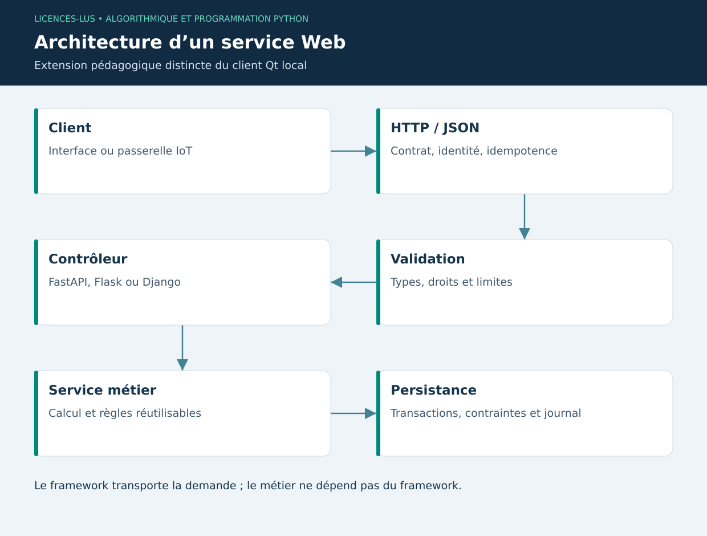

# 11 — Backend Web : FastAPI, Flask et Django

[Précédent](10-cyber.md) · [Sommaire](../README.md) · [Suivant](12-iot.md)

## Objectifs

Définir un contrat HTTP/JSON, valider les données d'une requête et choisir un framework selon le produit. Une API pourra à terme recevoir les mesures de la passerelle IoT et les rendre disponibles au client PyQt5.

## HTTP et séparation des couches

Une requête possède une méthode, un chemin, des en-têtes et éventuellement un corps. `GET` lit une ressource ; `POST` soumet une création ou un traitement. Une réponse possède un code de statut et un corps. JSON est un format d'échange, pas une validation. Un service doit vérifier types, valeurs, horodatage, identité et droits.

Le contrôleur HTTP traduit la requête ; le service métier calcule ; le dépôt de données conserve. Si le calcul GMQ importe FastAPI, il sera difficile à réutiliser dans Qt. Partager plutôt les fonctions pures et tester la frontière HTTP séparément.

## Choix du framework

| Framework | Points forts | Cas d'usage ici |
|---|---|---|
| FastAPI | Contrats typés, validation Pydantic, OpenAPI, ASGI | API capteurs et prédictions |
| Flask | Microframework explicite et extensible | Petit service ou prototype contrôlé |
| Django | ORM, migrations, administration, authentification intégrée | Portail de gestion complet avec rôles |

FastAPI n'ajoute pas automatiquement une base ou des autorisations. Flask demande de choisir davantage de composants. Django structure plus fortement le projet ; ses mécanismes intégrés doivent eux aussi être configurés correctement.

## Exemple FastAPI

```python
from datetime import datetime
from fastapi import FastAPI
from pydantic import BaseModel, Field

app = FastAPI()

class Mesure(BaseModel):
    temperature: float = Field(ge=-50, le=70)
    humidity: float = Field(ge=0, le=100)

@app.post("/mesures")
def recevoir(mesure: Mesure):
    return {"acceptee": True, "mesure": mesure.model_dump()}
```

Ce fragment valide puis renvoie une mesure ; il ne la persiste pas. Le script complet `11_api.py` ajoute bâtiment, fuseau obligatoire et test local via `TestClient`. Il reste volontairement un exercice distinct de l'application Qt : aucune API n'est exposée par le projet livré.

## Exemples Flask et Django

`11_flask.py` fournit une route de lecture `/etat` avec son test. Le guide `11_django.md` construit une application et une route équivalente, puis explique comment évoluer vers modèle, migration et administration. Comparer les trois approches sur un même besoin rend le choix concret.

Un `async def` est utile pour attendre des opérations I/O compatibles ; il ne rend pas un entraînement CPU lourd non bloquant. Le serveur de développement sert aux TP locaux. Une exploitation distante requiert serveur adapté, TLS, authentification, limites de débit, suivi des erreurs et gestion des secrets.

## TP 11

Lancer `python exemples/11_api.py` : les tests vérifient une mesure valide et un refus pour 150 % d'humidité. Exécuter `11_flask.py`. Installer Django séparément et suivre son guide. Proposer une clé d'idempotence pour éviter les doubles mesures lors d'une retransmission ; expliquer pourquoi un simple retry peut dupliquer une création.

**Critères :** réponse JSON, erreur de validation, séparation API/métier, aucune prétention de sécurité de production sans mécanisme implémenté. [Correction](../CORRIGES.md#tp-11).

**Références :** [FastAPI](https://fastapi.tiangolo.com/tutorial/), [Flask](https://flask.palletsprojects.com/en/stable/quickstart/), [Django](https://docs.djangoproject.com/en/5.2/intro/tutorial01/).

## Architecture proposée


