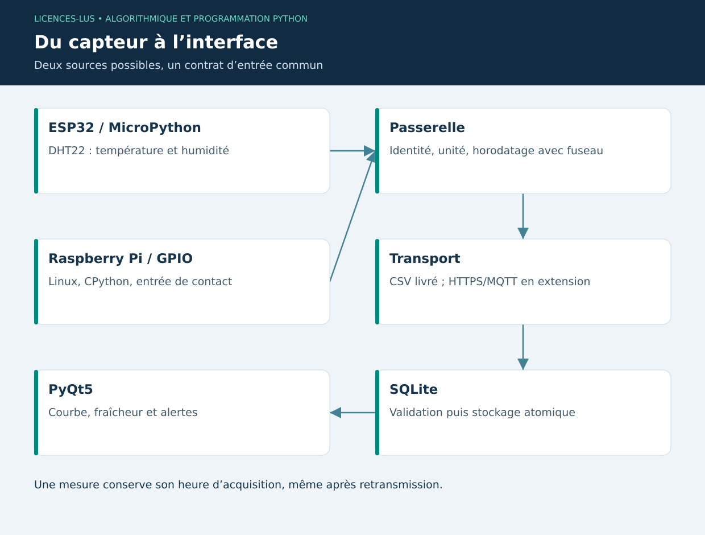

# 12 — IoT et embarqué : MicroPython et Raspberry Pi

[Précédent](11-web.md) · [Sommaire](../README.md) · [Suivant](13-sciences.md)

## Objectifs

Distinguer microcontrôleur et ordinateur embarqué, définir le contrat d'une mesure et prévoir panne réseau, horloge incorrecte et données dupliquées. La simulation doit conserver les mêmes unités que le futur capteur.

## Deux environnements Python

**MicroPython** adapte une partie de Python à des microcontrôleurs comme l'ESP32. Mémoire et bibliothèques sont limitées : on ne suppose pas la disponibilité de Pandas ou PyTorch. `machine.Pin`, ADC et bus I²C/SPI pilotent le matériel selon le port et la carte.

**Raspberry Pi** est un ordinateur Linux exécutant CPython. Il peut héberger une passerelle, un service Web ou de l'inférence légère. GPIO Zero fournit une abstraction pratique des entrées/sorties ; le backend de broches et la compatibilité dépendent du modèle de Pi et du système installé. Vérifier la numérotation BCM et la tension des signaux avant câblage.

## ESP32 : lecture d'un capteur DHT22

```python
# MicroPython sur carte ESP32 compatible, pas CPython sur PC.
from machine import Pin
import dht
import time

capteur = dht.DHT22(Pin(4))
for _ in range(3):
    capteur.measure()
    print(capteur.temperature(), capteur.humidity())
    time.sleep(2)
```

Les deux secondes respectent la cadence lente de ce capteur dans cet exemple. Le câblage, la résistance de tirage et la tension doivent suivre la fiche du module possédé ; le code seul ne valide pas le montage. Une lecture peut échouer : la passerelle doit conserver une erreur explicite, pas envoyer zéro comme température de remplacement.

## Raspberry Pi : entrée GPIO

```python
# À exécuter sur Raspberry Pi avec matériel compatible.
from gpiozero import Button

with Button(17, pull_up=True) as contact:
    print("Contact fermé :", contact.is_pressed)
```

Un bouton reliant GPIO17 à GND fournit ici une entrée logique. Ne pas brancher un signal 5 V sur une entrée 3,3 V. Les GPIO ne commandent pas directement un moteur ou une charge de puissance ; le projet pédagogique n'actionne aucun équipement d'élevage.

## Du capteur à l'écran

Le capteur mesure ; une passerelle donne identité, unité et horodatage ; le transport transmet ; l'application valide et stocke ; le tableau de bord calcule et affiche. Une mesure utile comprend bâtiment, capteur, instant de mesure et qualité. Pour le CSV minimal livré, la paire bâtiment/horodatage identifie un événement : plusieurs capteurs simultanés nécessiteront un champ supplémentaire `sensor_id`.

HTTP convient aux envois vers une API ; MQTT organise publication/abonnement via un broker. Les garanties de livraison ne dispensent pas d'une clé d'idempotence. En cas de déconnexion, utiliser une file locale bornée, réessayer avec délai progressif et conserver la date de mesure originale. Distinguer heure de mesure et heure de réception.

## TP 12 sans matériel

Exécuter `python exemples/12_simulateur.py`. Importer le CSV généré dans l'onglet Capteurs du projet. Observer que les bâtiments doivent correspondre aux animaux. Modifier la date pour la rendre ancienne, puis vérifier que l'assistant indique une donnée périmée. Le simulateur local constitue le chemin vérifié ; les deux scripts matériels sont des exemples à adapter et à tester sur la carte disponible.

**Critères :** fuseau présent, % et °C documentés, source simulée/importée visible, comportement défini en cas de doublon. [Correction](../CORRIGES.md#tp-12).

**Références :** [MicroPython ESP32](https://docs.micropython.org/en/latest/esp32/quickref.html), [GPIO Zero](https://gpiozero.readthedocs.io/en/stable/).

## Flux de bout en bout


