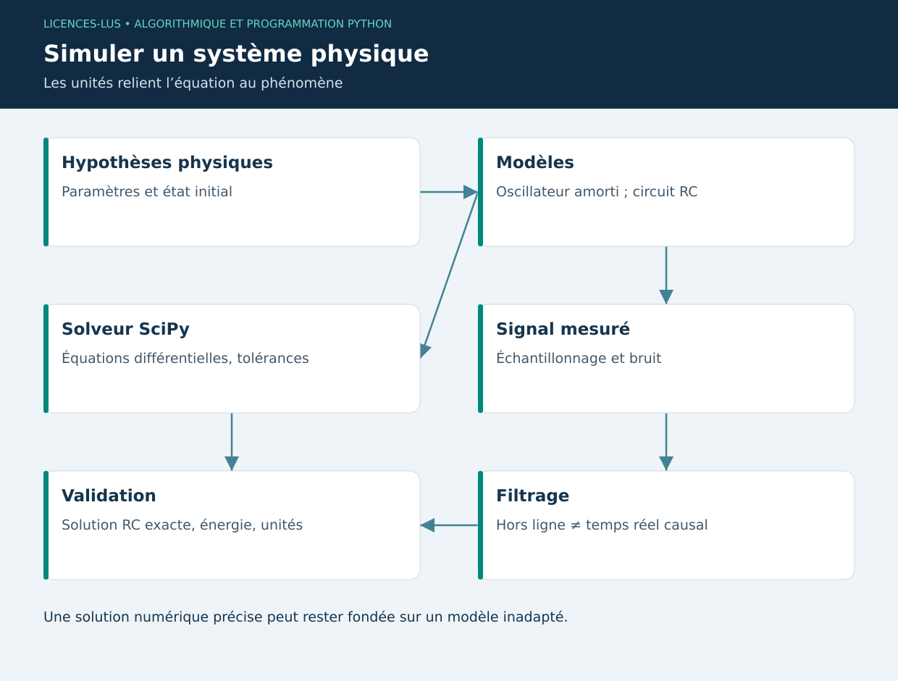

# 13 — Mécanique, électronique et traitement du signal avec SciPy

[Précédent](12-iot.md) · [Sommaire](../README.md) · [Suivant](14-projet.md)

## Objectifs

Traduire une loi physique en équation différentielle, choisir des paramètres avec unités et interpréter le résultat d'une simulation numérique. Une précision de calcul élevée ne garantit pas que le modèle représente correctement le système réel.

## Mécanique : oscillateur amorti

Pour une masse reliée à un ressort et un amortisseur : `m x'' + c x' + k x = 0`. Avec `v = x'`, l'état devient `[x,v]` et les dérivées `[v, -(c v + k x)/m]`. m est en kg, c en N·s/m, k en N/m. L'état initial décrit position et vitesse ; sans ces conditions, le problème n'est pas entièrement défini.

```python
import numpy as np
from scipy.integrate import solve_ivp

m, c, k = 1.0, 0.4, 4.0
def systeme(t, etat):
    x, v = etat
    return [v, -(c * v + k * x) / m]

t = np.linspace(0, 10, 201)
solution = solve_ivp(systeme, (0, 10), [0.1, 0], t_eval=t,
                     rtol=1e-7, atol=1e-9)
assert solution.success
print(solution.y[:, -1])
```

`solve_ivp` adapte ses pas internes ; `t_eval` choisit les instants de sortie, pas nécessairement les pas du solveur. Examiner `success`, les unités, la sensibilité aux tolérances et une propriété physique. Sans excitation, l'énergie mécanique doit décroître si l'amortissement est positif, à l'erreur numérique près.

## Électronique : réponse d'un circuit RC

Pour une tension d'entrée constante E, `dVc/dt = (E - Vc)/(R C)`. La constante de temps vaut τ = RC, en secondes. Avec R = 1 000 Ω et C = 100 µF, τ = 0,1 s. Depuis 0 V, la solution analytique est `Vc(t) = E(1-exp(-t/τ))`. À t = τ, elle atteint environ 63,2 % de E. Cette valeur sert de test indépendant du solveur.

`13_sciences.py` compare solution numérique et solution analytique, puis sauvegarde les tracés. Modifier R ou C permet de prédire l'évolution de la vitesse de charge avant de lancer le programme.

## Signal : filtrage et échantillonnage

Un capteur transforme un signal continu en échantillons. Pour un signal limité en bande, la fréquence d'échantillonnage doit dépasser deux fois la plus haute fréquence conservée ; en pratique, prévoir marge et filtre anti-repliement analogique. Un filtre numérique après acquisition ne peut pas retrouver les fréquences déjà repliées.

`scipy.signal.butter` conçoit un filtre ; la forme SOS améliore la stabilité numérique. `sosfiltfilt` effectue un filtrage avant/arrière et n'est pas causal : il convient à l'analyse hors ligne, pas au temps réel. Une passerelle utiliserait par exemple `sosfilt` avec son état conservé et devrait accepter un retard.

Un lissage peut masquer une pointe importante. Conserver les données brutes, documenter fréquence de coupure et ordre, et ne pas appliquer un filtre conçu pour 100 Hz à une série irrégulière sans traitement préalable.

## TP 13

Exécuter `python exemples/13_sciences.py`. Vérifier 3,1606 V pour E=5 V à t=0,1 s avec la tolérance numérique annoncée. Doubler R et prévoir le nouveau τ. Comparer signal brut et filtré ; expliquer pourquoi le filtre hors ligne ne doit pas servir tel quel à une alarme en direct.

**Critères :** paramètres dimensionnés, solveur contrôlé, comparaison analytique, distinction causal/non causal. [Correction](../CORRIGES.md#tp-13).

**Références :** [Intégration SciPy](https://docs.scipy.org/doc/scipy/reference/generated/scipy.integrate.solve_ivp.html), [Traitement du signal](https://docs.scipy.org/doc/scipy/tutorial/signal.html).

## Chaîne de simulation


