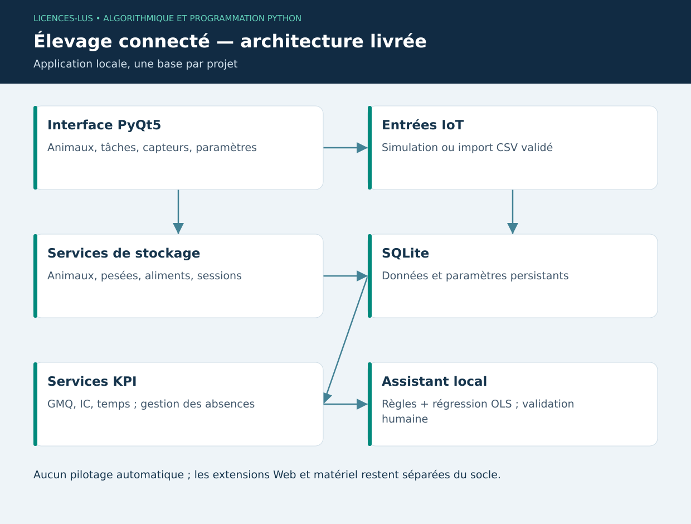

# 14 — PyQt5 et intégration du projet industriel

[Précédent](13-sciences.md) · [Sommaire](../README.md) · [Projet exécutable](../projet-elevage/README.md)

## Objectifs

Assembler les notions précédentes dans une application utilisable, tester les parcours et documenter les limites. Le sujet complet et ses jalons sont dans [PROJET.md](../PROJET.md).

## Interface événementielle

Une application Qt crée un `QApplication`, construit ses widgets puis lance la boucle d'événements. Un **signal** annonce une action ; un **slot** y répond. Connecter le clic d'un bouton à une fonction évite d'interroger continuellement son état. Les widgets ne doivent être modifiés que depuis le thread GUI.

```python
# Fragment explicatif : programme autonome complet dans projet-elevage/main.py.
from PyQt5.QtWidgets import QApplication, QPushButton

def ouvrir_exemple():
    app = QApplication([])
    bouton = QPushButton("Vérifier les mesures")
    bouton.clicked.connect(lambda: bouton.setText("Vérification demandée"))
    bouton.show()
    return app.exec_()
```

Une lecture réseau longue ou un entraînement dans un slot fige l'interface. Les petits calculs locaux du projet sont synchrones et bornés. Pour un modèle lourd, utiliser un worker `QThread`/`QRunnable`, transférer des résultats par signaux et prévoir annulation/erreurs. Une connexion SQLite créée sur un thread ne se partage pas arbitrairement avec un autre.

## Responsabilités et couplage

`ui.py` lit une saisie, appelle `storage.py`, puis actualise une vue. `domain.py` calcule sans Qt ni SQL. `assistant.py` consulte l'historique et produit un bilan explicable. Cette séparation permet de tester les calculs sans fenêtre et de remplacer ultérieurement SQLite par un service sans réécrire toutes les règles métier.

Le projet ne regroupe pas artificiellement tous les frameworks : le socle utilise PyQt5 et la bibliothèque standard. Les exemples scikit-learn, Web et IoT servent à comprendre les extensions. Un installateur géant contenant TensorFlow, Django et Scapy sans usage effectif compliquerait la maintenance.

## KPI et temporalité

Le GMQ utilise les jours réellement écoulés ; l'IC exige la consommation complète sur une fenêtre définie ; le chronomètre utilise une horloge monotone pour éviter les sauts de l'horloge civile. Un horodatage UTC sert à enregistrer le début de session, tandis que la durée vient de l'horloge monotone.

Une température élevée ancienne ne représente pas nécessairement l'état présent. L'assistant vérifie d'abord la fraîcheur du capteur. Les pesées trop anciennes désactivent la projection. Les seuils initiaux sont des choix de TP, à adapter au contexte d'exploitation.

## Parcours d'intégration

1. Lancer avec une base de démonstration et vérifier BOV-001 : 800 g/j, IC 5 kg/kg.
2. Ajouter un animal vide : aucun GMQ inventé ; l'assistant signale les mesures manquantes.
3. Saisir deux pesées valides puis une pesée dupliquée : les deux premières persistent, le doublon est refusé.
4. Démarrer et arrêter une tâche : le temps réel est enregistré ; la fermeture normale sauvegarde aussi une session active.
5. Importer un lot de mesures dont une ligne est invalide : aucun enregistrement partiel.
6. Consulter la projection et ses hypothèses, exporter les pesées puis redémarrer l'application.

Les tests automatisés couvrent ces risques essentiels, mais une démonstration manuelle reste utile pour lisibilité, navigation et compréhension des erreurs. L'accessibilité et le comportement sur chaque système de bureau demandent également une revue réelle.

## TP 14

Exécuter le projet et sa suite de tests. Ajouter une fonction de productivité « nombre de tâches terminées / heure enregistrée », en traitant le cas zéro heure. Écrire d'abord deux résultats attendus à la main. Ajouter ensuite l'affichage sans copier de requêtes SQL dans le calcul pur.

**Critères :** installation reproductible, aucune donnée fictive présentée comme réelle, test du dénominateur nul, interface réactive, explication orale de chaque couche. [Correction](../CORRIGES.md#tp-14).

**Référence :** [Documentation PyQt5](https://www.riverbankcomputing.com/static/Docs/PyQt5/).

## Architecture finale


