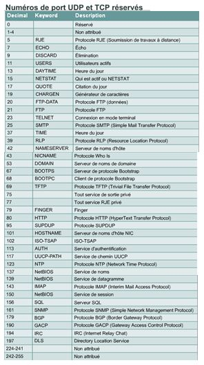

# Chapitre 1 : Couche Transport et Couche Application (TCP/IP)

## 1. Couche Transport

### Rôle principal
- Acheminer les données entre applications source et destination.
- Assurer **fiabilité** et **contrôle de flux**.
- Établir une **connexion logique** de bout en bout.

### Services de base
- Segmentation des données.
- Connexion de bout en bout.
- Contrôle de flux (fenêtres glissantes).
- Fiabilité (numéros de séquence + accusés de réception).

---

### Contrôle de flux
- Empêche la perte de données si le récepteur est trop lent.
- TCP ajuste le débit entre source et destination.

---

### Établissement et fermeture de session
- Multiplexage : plusieurs applications partagent une même connexion.
- Connexion orientée (TCP) → nécessite synchronisation et ACK.
- Fermeture : signal de fin + accusé de réception.

---

### Échange en trois étapes (Three-Way Handshake)
1. **SYN** : l’émetteur initie la connexion.
2. **SYN + ACK** : le récepteur accepte et synchronise.
3. **ACK** : confirmation finale → connexion établie.

---

### Fenêtrage
- Permet d’envoyer plusieurs paquets avant d’attendre un accusé.
- La **taille de fenêtre** est négociée dynamiquement.
- Exemple : fenêtre = 3 → l’émetteur envoie 3 paquets avant d’attendre l’ACK.

---

### Accusé de réception
- Garantit la fiabilité.
- Chaque segment est numéroté.
- Si un segment est perdu ou non confirmé → retransmission.

---

### Protocole TCP
- Orienté connexion.
- Transmission fiable en **full duplex**.
- Découpe les messages en segments et les réassemble.
- Protocoles utilisant TCP : **FTP, HTTP, SMTP, Telnet**.

**Champs principaux d’un segment TCP :**
- Port source / destination.
- Numéro de séquence.
- Numéro d’accusé de réception.
- Fenêtre.
- Somme de contrôle.
- Options (ex. MSS).

---

### Protocole UDP
- Non orienté connexion.
- Pas de fiabilité intégrée (pas d’ACK, pas de fenêtres).
- Rapide et léger.
- Protocoles utilisant UDP : **TFTP, SNMP, DHCP, DNS**.

**Champs principaux d’un segment UDP :**
- Port source / destination.
- Longueur.
- Somme de contrôle.

---

### Numéros de port TCP/UDP
- Ports < 1024 → ports bien connus (ex. HTTP 80, FTP 21, SMTP 25).
- Ports > 1024 → ports dynamiques attribués par le système.
- Utilisés pour distinguer les différentes applications.

---

## 2. Couche Application

### Introduction
- Regroupe les couches **session, présentation et application** du modèle OSI.
- Gère la représentation, le dialogue et le code des données.
- Protocoles connus : **DNS, FTP, HTTP, SMTP, SNMP, Telnet**.

---

### Protocoles principaux

#### DNS
- Traduit les noms de domaine en adresses IP.
- Exemple : `www.google.com` → `142.250.190.14`.

#### FTP / TFTP
- **FTP** : fiable, orienté TCP, transfert de fichiers (ports 20/21).
- **TFTP** : simple, basé sur UDP, utilisé pour configurer des routeurs.

#### HTTP
- Protocole du Web.
- Client (navigateur) ↔ serveur (site web).
- Utilise le port 80 (ou 443 pour HTTPS).

#### SMTP
- Envoi de mails (port 25).
- Utilise TCP.
- Complété par POP3 (110) ou IMAP4 (143) pour la réception.

#### SNMP
- Gestion des réseaux.
- Basé sur UDP.
- Composants : NMS (console d’administration), agents SNMP, unités gérées.

#### Telnet
- Connexion distante en ligne de commande.
- Client ↔ serveur Telnet.
- Peu sécurisé (pas de chiffrement).

---

## Résumé visuel

| Couche | Protocoles | Caractéristiques |
|--------|------------|------------------|
| Transport | TCP, UDP | Fiabilité, contrôle de flux, ports |
| Application | DNS, FTP, HTTP, SMTP, SNMP, Telnet | Services aux utilisateurs |

---

## Ressources pour aller plus loin
- [RFC 793 – TCP Specification](https://www.rfc-editor.org/rfc/rfc793)
- [RFC 768 – UDP Specification](https://www.rfc-editor.org/rfc/rfc768)
- [IANA Port Numbers](https://www.iana.org/assignments/service-names-port-numbers/service-names-port-numbers.xhtml)
- [Cisco Networking Academy – TCP/IP Layers](https://www.netacad.com/)
